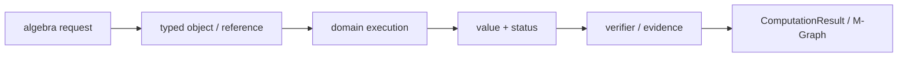
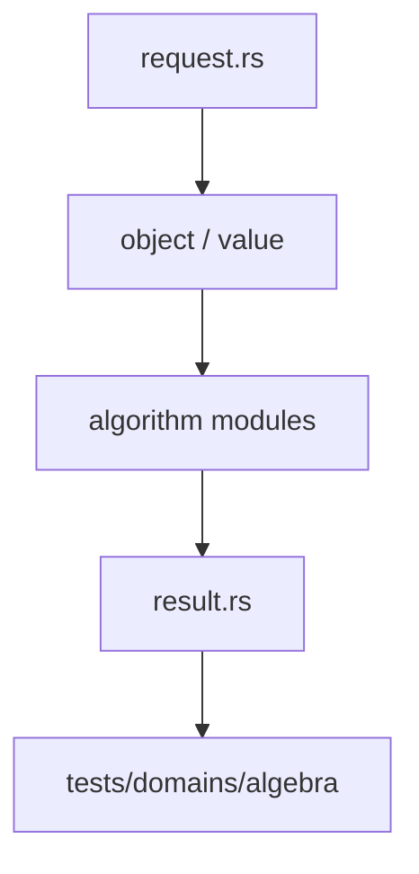

# 代数基础设施

`algebra` 是 Athena 各代数领域共享的父对象与表示层。它统一维护系数 parent、域扩张、群与域元素、presentation、映射、子群以及稳定 fingerprint。

## 负责什么

- `CoefficientParent`、`AlgebraParentId` 与 parent table
- `FieldExtension`、数域和有限域多项式坐标
- 置换、BSGS、子群、商群和群性质事实
- `AlgebraElement`、`MapTable` 与元素来源记录
- canonical 坐标、Frobenius、自同构和对象 fingerprint

`group`、`field`、`galois` 与 `polynomial` 通过这里共享身份和表，不各自复制 parent 或 map 语义。元素必须绑定所属 parent，跨 parent 运算应返回结构化 mismatch 诊断。

## 公开入口

主要类型包括 `CoefficientParent`、`FieldExtension`、`AlgebraElement`、`GroupTable`、`MapTable`、`BsgsChain`、`FieldFingerprint` 与 `GroupFingerprint`。有限域坐标可使用 `add_coords`、`mul_coords`、`inv_coords` 和 `frobenius_coords`。

## 边界

本模块提供代数对象的身份、表示和共享操作。具体领域请求仍由 `field`、`group`、`galois` 或 `polynomial` 分派，证明准入由 engine 的 reasoning 层负责。不要把对象 fingerprint 当作数学证明，也不要用字符串标签代替 typed relation。

## 测试

共享合同位于 `projects/athena-engine/tests/domains/algebra/`，覆盖 parent、有限域、扩张塔、置换 BSGS、子群商和 fingerprint。

## 架构图

## 合同表

| 阶段 | 输入 | 输出 | 必须保留 |
|---|---|---|---|
| 构造 | domain object、parent、scope | typed reference | identity、revision |
| 计划 | request、limits、capability | domain plan | algorithm、budget |
| 执行 | canonical representation | value、candidate 或 frontier | provenance、diagnostic |
| 验证 | value、certificate、dependencies | accepted claim 或 reject | replay evidence |
| 发布 | verified result | structured result | status、coverage、conditions |

## 源码阅读顺序

先读 `request.rs`，确认输入的身份和资源字段。再读对象/值模块，确认 payload、parent 和生命周期。随后读算法实现，最后读 `result.rs` 与测试，核对成功、失败和资源受限分支。

## 结果与证据

| 情况 | 结果状态 | 可以做什么 |
|---|---|---|
| 独立验证通过 | `Exact` 或 `Verified` | 按证书保证继续组合 |
| 依赖假设或分支 | `Conditional` | 携带条件继续查询 |
| 只得到候选 | `Candidate` | 等待 verifier，不得准入 |
| 算法被预算截断 | `Partial` / `ResourceLimited` | 保存 frontier 后恢复 |
| 输入或能力不满足 | `Invalid` / `Unknown` | 读取结构化诊断 |

证据不是日志字段。它必须能说明输入对象、算法前置条件、依赖关系和重放方式。缓存只能复用计算产物，不能代替验证和准入。

## 测试矩阵

| 测试层 | 必须证明 |
|---|---|
| 对象与规范化 | identity、parent、canonical form |
| 算法 | 正常值、边界值、域不匹配、除零或无解 |
| 结果 | payload、status、coverage、diagnostic |
| 资源 | budget、取消、frontier、resume |
| 证据 | replay、冲突、candidate 与 admission |

## 明确边界

本模块不解析源文本，不负责 UI、render、N-API 或平台对象。跨领域调用必须使用显式 capability、embedding 或 TypedView，并保留来源 fingerprint 与 revision。新增算法必须同步新增结果状态、失败路径和测试，不得只增加一个函数名。
