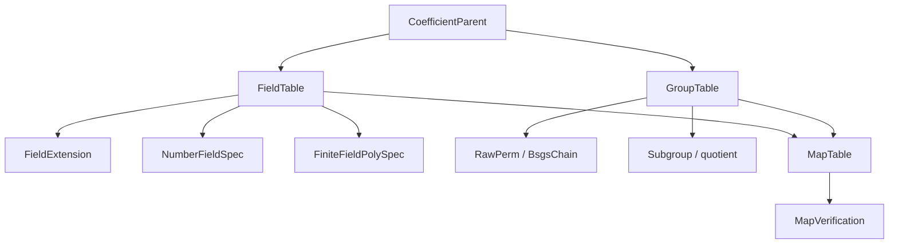

# 代数基础设施

## 共享 parent、表示与映射

| 子系统 | 表示 | 关键算法 |
|---|---|---|
| 有限域 | polynomial-basis coordinates modulo `p` | canonical、mul、inverse、Frobenius |
| 数域 | rational power-basis coordinates | minimal polynomial、tower multiplication/inverse |
| 置换群 | `RawPerm` + generators | BSGS membership、enumeration |
| 子群与商 | subgroup chain + coset representatives | normality、quotient generators |
| 映射 | `AlgebraMap` + verification | embedding、automorphism、homomorphism、projection |

`FieldFingerprint` 与 `GroupFingerprint` 标识 presentation，不能代替同构证明。`MapTable` 只登记已明确来源和目标的映射，`require_proven` 阻止未验证 map 被当作可靠 coercion。

推荐阅读：`parent.rs` / `presentation.rs` → `table.rs` / `group_table.rs` → `finite_field_poly.rs` / `number_field.rs` / `bsgs.rs` / `subgroup.rs` → `map.rs` / `map_table.rs` → `property.rs`。

`algebra` 是 Athena 各代数领域共享的父对象与表示层。它统一维护系数 parent、域扩张、群与域元素、presentation、映射、子群以及稳定 fingerprint。

## 负责什么

- `CoefficientParent`、`AlgebraParentId` 与 parent table
- `FieldExtension`、数域和有限域多项式坐标
- 置换、BSGS、子群、商群和群性质事实
- `AlgebraElement`、`MapTable` 与元素来源记录
- canonical 坐标、Frobenius、自同构和对象 fingerprint

`group`、`field`、`galois` 与 `polynomial` 通过这里共享身份和表，不各自复制 parent 或 map 语义。元素必须绑定所属 parent，跨 parent 运算应返回结构化 mismatch 诊断。

## 公开入口

主要类型包括 `CoefficientParent`、`FieldExtension`、`AlgebraElement`、`GroupTable`、`MapTable`、`BsgsChain`、`FieldFingerprint` 与 `GroupFingerprint`。有限域坐标可使用 `add_coords`、`mul_coords`、`inv_coords` 和 `frobenius_coords`。

## 边界

本模块提供代数对象的身份、表示和共享操作。具体领域请求仍由 `field`、`group`、`galois` 或 `polynomial` 分派，证明准入由 engine 的 reasoning 层负责。不要把对象 fingerprint 当作数学证明，也不要用字符串标签代替 typed relation。

## 测试

共享合同位于 `projects/athena-engine/tests/domains/algebra/`，覆盖 parent、有限域、扩张塔、置换 BSGS、子群商和 fingerprint。
