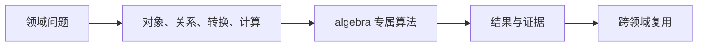
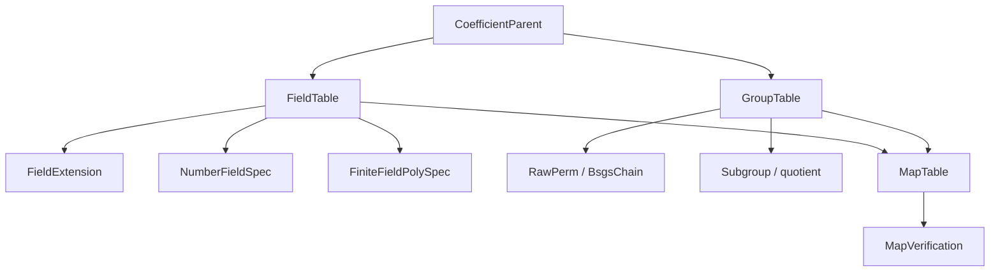

# 代数基础设施

## 模块解决的问题

Athena 的域、群、伽罗瓦和多项式不能各自定义 parent、presentation 和 map。这个共享层解决的是同一个数学对象在不同领域中身份不一致的问题。

## 交叉问题

field 需要它登记 `FieldTable` 和 embedding，group 需要 `GroupTable` 与 BSGS，galois 需要把域自同构注册为群元素，polynomial 需要系数 parent。缺少共享层时，跨域转换只能靠字符串或裸整数，无法验证 source/target。

## 处理流

先登记 parent 和 presentation，再构造元素和 fingerprint，随后登记 map 并附 verification。下游领域只消费已登记的 ID，不复制对象身份。

## 共享 parent、表示与映射

| 子系统 | 表示 | 关键算法 |
|---|---|---|
| 有限域 | polynomial-basis coordinates modulo `p` | canonical、mul、inverse、Frobenius |
| 数域 | rational power-basis coordinates | minimal polynomial、tower multiplication/inverse |
| 置换群 | `RawPerm` + generators | BSGS membership、enumeration |
| 子群与商 | subgroup chain + coset representatives | normality、quotient generators |
| 映射 | `AlgebraMap` + verification | embedding、automorphism、homomorphism、projection |

`FieldFingerprint` 与 `GroupFingerprint` 标识 presentation，不能代替同构证明。`MapTable` 只登记已明确来源和目标的映射，`require_proven` 阻止未验证 map 被当作可靠 coercion。

推荐阅读：`parent.rs` / `presentation.rs` → `table.rs` / `group_table.rs` → `finite_field_poly.rs` / `number_field.rs` / `bsgs.rs` / `subgroup.rs` → `map.rs` / `map_table.rs` → `property.rs`。

`algebra` 是 Athena 各代数领域共享的父对象与表示层。它统一维护系数 parent、域扩张、群与域元素、presentation、映射、子群以及稳定 fingerprint。

## 负责什么

- `CoefficientParent`、`AlgebraParentId` 与 parent table
- `FieldExtension`、数域和有限域多项式坐标
- 置换、BSGS、子群、商群和群性质事实
- `AlgebraElement`、`MapTable` 与元素来源记录
- canonical 坐标、Frobenius、自同构和对象 fingerprint

`group`、`field`、`galois` 与 `polynomial` 通过这里共享身份和表，不各自复制 parent 或 map 语义。元素必须绑定所属 parent，跨 parent 运算应返回结构化 mismatch 诊断。

## 公开入口

主要类型包括 `CoefficientParent`、`FieldExtension`、`AlgebraElement`、`GroupTable`、`MapTable`、`BsgsChain`、`FieldFingerprint` 与 `GroupFingerprint`。有限域坐标可使用 `add_coords`、`mul_coords`、`inv_coords` 和 `frobenius_coords`。

## 边界

本模块提供代数对象的身份、表示和共享操作。具体领域请求仍由 `field`、`group`、`galois` 或 `polynomial` 分派，证明准入由 engine 的 reasoning 层负责。不要把对象 fingerprint 当作数学证明，也不要用字符串标签代替 typed relation。

## 测试

共享合同位于 `projects/athena-engine/tests/domains/algebra/`，覆盖 parent、有限域、扩张塔、置换 BSGS、子群商和 fingerprint。

## 与源码和测试的对应

阅读 [parent.rs](./parent.rs) 和 [presentation.rs](./presentation.rs) 可以看到身份如何形成，随后读 [table.rs](./table.rs)、[group_table.rs](./group_table.rs) 查看对象登记，再读 [map.rs](./map.rs) 与 [map_table.rs](./map_table.rs) 查看跨域验证。测试应覆盖同一对象重复 intern、不同 presentation 不误合并、映射 source/target 错误和 property 从 unknown 到 proven 的转换。只有这些基础合同稳定，field、group、galois 和 polynomial 才能共享结果。

## 深入理解

parent 是运算合法性的第一道门。FieldId、GroupId、ExtensionId 和 AlgebraMapId 不是缓存索引，而是数学对象的组成部分。`FieldTable` 负责登记 characteristic、presentation 和扩张塔，`GroupTable` 负责生成元、BSGS chain、子群与商群。两张表通过 `MapTable` 连接，但连接必须记录 source、target 和 verification。这样同一个元素在不同坐标系中转换时，调用方仍能追溯它来自哪个对象。

扩张域的坐标乘法先做多项式卷积，再按 modulus 约化。置换群则先验证 images 是双射，再把生成元送入 stabilizer chain。两种算法完全不同，却共享 fingerprint、property state 和 map verification。这正是本模块存在的理由：共享的是对象语义，而不是把所有算法揉成一个大接口。

## 失败路径与验证

`MapVerification` 有 unverified、proven 和 disproven 三种状态。下游请求只有在需要证明的场景才允许消费 proven map。`PropertyState` 同样区分 unknown、candidate 与 proven，群阶、正规性、扩张可分性不能通过一个普通 bool 丢失来源。对象表的 intern 过程必须检查 presentation 参数是否相等，否则两个不同 modulus 或 generator set 可能错误复用同一 ID。

## 维护者阅读清单

修改 `parent.rs` 时必须检查 field、group、galois 和 polynomial 的所有表。修改 `map_table.rs` 时必须检查 embedding、automorphism、homomorphism 和 quotient projection 的证书。修改 fingerprint 时必须检查缓存键、TypedView 来源和 M-Graph relation dependency。测试不能只覆盖成功构造，还要覆盖错误 parent、非法 permutation、不可逆 map 和未验证 property。

## 为什么不能拆成多个独立地基

如果 field 自己定义 fingerprint，group 自己定义 map，galois 再定义一套 extension id，那么同一个扩张在不同领域会出现多个身份，缓存与证书也无法互相引用。共享 algebra 层把身份、presentation、map 和 property state 放在一个可审计边界内；领域算法仍保持分离，但对象可以安全交叉。
