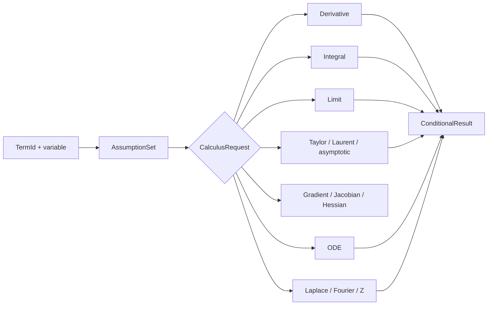
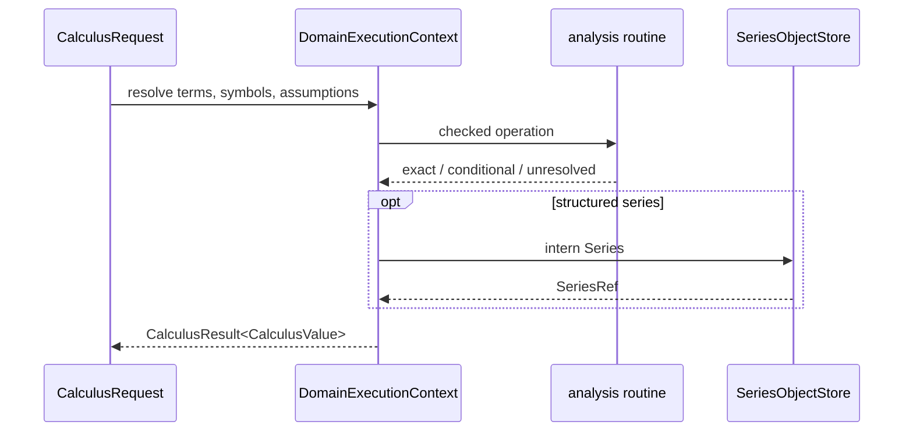

# 微积分

## 假设驱动的分析分支

| 分支 | 专属输入 | 专属输出 | 不能省略 |
|---|---|---|---|
| 求导 | `DerivativeOrder`、变量 | `TermId` | 链式法则与变量绑定 |
| 积分 | 上下限、变量、假设 | primitive / definite value | 条件、未积分残差 |
| 极限 | `LimitApproach`、`LimitDirection` | limit value | 单侧方向和发散状态 |
| 级数 | center、order | `Series` | `Remainder` |
| ODE | 方程、dependent variable | `DifferentialSolution` | `VerificationStatus` |
| 变换 | `TransformKind` | `TransformResult` | `RegionOfConvergence` |

`result.rs` 的 `ConditionalResult<T>` 是共同出口，`value.rs` 的 `map_*_result` 保留各分支的领域 payload。`materialize_calculus_result_term` 只是宿主投影，不能反过来取代条件、ROC、remainder 或 ODE 验证状态。

[request.rs](./request.rs) → [derivative.rs](./derivative.rs) / [integral.rs](./integral.rs) / [limit.rs](./limit.rs) / [series.rs](./series.rs) / [vector.rs](./vector.rs) / [differential.rs](./differential.rs) / [transform.rs](./transform.rs) → [result.rs](./result.rs) → [value.rs](./value.rs)。

`calculus` 提供符号微积分与变换的领域实现，结果通过 `CalculusResult` 表达条件、未完成状态和验证信息。

## 能力

- `differentiate` 与 `differentiate_checked`
- 不定积分、定积分、极限和留数
- Taylor、Laurent、渐近级数及余项
- gradient、Jacobian、Hessian、divergence、curl
- ODE 子集与回代验证
- Laplace、Fourier、Z 变换及收敛域

入口请求类型是 `CalculusRequest`，结果类型包括 `CalculusResult`、`ConditionalResult`、`Series`、`TransformResult` 和 `Residue`。对象通过 `SeriesRef` 与 `SeriesObjectStore` 管理。

## 结果语义

条件、分支、收敛域、余项和未完成信息必须随结果返回。一个形式项不能自动代表完整积分、通解或极限证明。`unresolved` 用于保留缺口，`VerificationStatus` 用于区分已回代与待验证结果。

## 边界

本模块接收已构造的 `TermId` 和领域对象，不解析源文本，不实现方言 render，也不替代 `solve` 的解集合同。符号项的构造与执行仍经过 `athena-ir` 和 `ExecutionIR`。

## 测试

微积分的模块测试位于本模块内部，执行合同与跨领域测试位于 `projects/athena-engine/tests/domains/calculus/`。
## 请求与执行

`CalculusRequest` 将 derivative、integral、limit、series、transform、vector calculus 和 ODE 作为不同目标。执行在 `DomainExecutionContext` 中读取 `TermId`，结果进入 `CalculusResult`，再由 value mapper 投影为 term 或领域对象。

路径：`CalculusRequest` → domain implementation → `ConditionalResult` → assumptions / remainder / verification → `ComputationResult`。

## 文件地图

`derivative.rs` 与 `symbol_rewrite.rs` 处理符号导数，`integral.rs`、`limit.rs`、`series.rs` 处理一元分析，`vector.rs` 处理梯度和 Jacobian，`differential.rs` 处理 ODE，`transform.rs` 处理变换及 ROC，`result.rs`/`value.rs` 负责状态和投影。

## 完整性

不定积分保留常数项和条件，级数保留阶数与 remainder，变换保留收敛域。未能证明的步骤使用 unresolved 结果，不能用一个 `TermId` 冒充完整证明。
