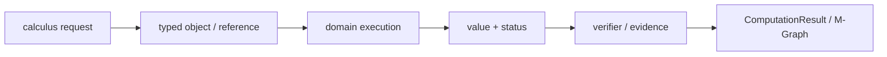
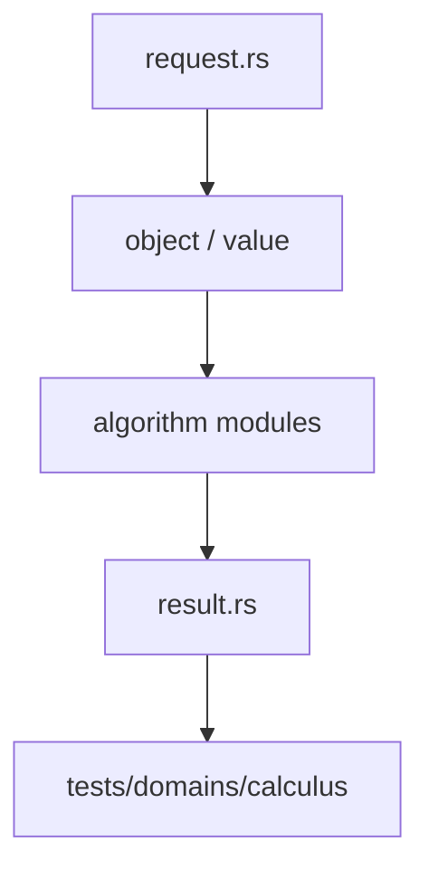

# 微积分

`calculus` 提供符号微积分与变换的领域实现，结果通过 `CalculusResult` 表达条件、未完成状态和验证信息。

## 能力

- `differentiate` 与 `differentiate_checked`
- 不定积分、定积分、极限和留数
- Taylor、Laurent、渐近级数及余项
- gradient、Jacobian、Hessian、divergence、curl
- ODE 子集与回代验证
- Laplace、Fourier、Z 变换及收敛域

入口请求类型是 `CalculusRequest`，结果类型包括 `CalculusResult`、`ConditionalResult`、`Series`、`TransformResult` 和 `Residue`。对象通过 `SeriesRef` 与 `SeriesObjectStore` 管理。

## 结果语义

条件、分支、收敛域、余项和未完成信息必须随结果返回。一个形式项不能自动代表完整积分、通解或极限证明。`unresolved` 用于保留缺口，`VerificationStatus` 用于区分已回代与待验证结果。

## 边界

本模块接收已构造的 `TermId` 和领域对象，不解析源文本，不实现方言 render，也不替代 `solve` 的解集合同。符号项的构造与执行仍经过 `athena-ir` 和 `ExecutionIR`。

## 测试

微积分的模块测试位于本模块内部，执行合同与跨领域测试位于 `projects/athena-engine/tests/domains/calculus/`。
## 请求与执行

`CalculusRequest` 将 derivative、integral、limit、series、transform、vector calculus 和 ODE 作为不同目标。执行在 `DomainExecutionContext` 中读取 `TermId`，结果进入 `CalculusResult`，再由 value mapper 投影为 term 或领域对象。

路径：`CalculusRequest` → domain implementation → `ConditionalResult` → assumptions / remainder / verification → `ComputationResult`。

## 文件地图

`derivative.rs` 与 `symbol_rewrite.rs` 处理符号导数，`integral.rs`、`limit.rs`、`series.rs` 处理一元分析，`vector.rs` 处理梯度和 Jacobian，`differential.rs` 处理 ODE，`transform.rs` 处理变换及 ROC，`result.rs`/`value.rs` 负责状态和投影。

## 完整性

不定积分保留常数项和条件，级数保留阶数与 remainder，变换保留收敛域。未能证明的步骤使用 unresolved 结果，不能用一个 `TermId` 冒充完整证明。

## 架构图

## 合同表

| 阶段 | 输入 | 输出 | 必须保留 |
|---|---|---|---|
| 构造 | domain object、parent、scope | typed reference | identity、revision |
| 计划 | request、limits、capability | domain plan | algorithm、budget |
| 执行 | canonical representation | value、candidate 或 frontier | provenance、diagnostic |
| 验证 | value、certificate、dependencies | accepted claim 或 reject | replay evidence |
| 发布 | verified result | structured result | status、coverage、conditions |

## 源码阅读顺序

先读 `request.rs`，确认输入的身份和资源字段。再读对象/值模块，确认 payload、parent 和生命周期。随后读算法实现，最后读 `result.rs` 与测试，核对成功、失败和资源受限分支。重点顺序是 request → derivative/integral/limit/series → result/value。

## 结果与证据

| 情况 | 结果状态 | 可以做什么 |
|---|---|---|
| 独立验证通过 | `Exact` 或 `Verified` | 按证书保证继续组合 |
| 依赖假设或分支 | `Conditional` | 携带条件继续查询 |
| 只得到候选 | `Candidate` | 等待 verifier，不得准入 |
| 算法被预算截断 | `Partial` / `ResourceLimited` | 保存 frontier 后恢复 |
| 输入或能力不满足 | `Invalid` / `Unknown` | 读取结构化诊断 |

证据不是日志字段。它必须能说明输入对象、算法前置条件、依赖关系和重放方式。缓存只能复用计算产物，不能代替验证和准入。

## 测试矩阵

| 测试层 | 必须证明 |
|---|---|
| 对象与规范化 | identity、parent、canonical form |
| 算法 | 正常值、边界值、域不匹配、除零或无解 |
| 结果 | payload、status、coverage、diagnostic |
| 资源 | budget、取消、frontier、resume |
| 证据 | replay、冲突、candidate 与 admission |

## 明确边界

本模块不解析源文本，不负责 UI、render、N-API 或平台对象。跨领域调用必须使用显式 capability、embedding 或 TypedView，并保留来源 fingerprint 与 revision。新增算法必须同步新增结果状态、失败路径和测试，不得只增加一个函数名。
