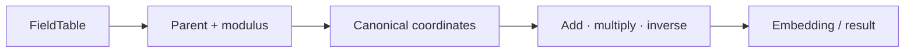
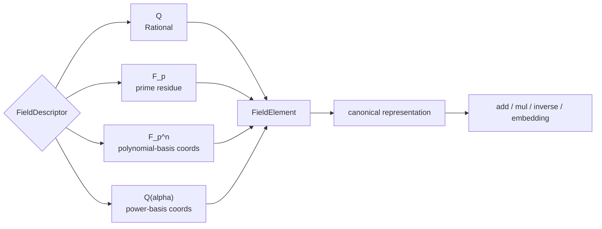

# 域与有限域

## 域元素的归属与合法运算

域模块解决元素归属和合法运算问题：同样的坐标在 `Q`、`F_p` 和 `Q(alpha)` 中含义不同，不能仅凭数值相等判断可相加。

## 交叉领域协作

polynomial 使用 FieldId 解释系数，galois 读取 FieldExtension 和 Frobenius，algebra 保存 embedding，number_theory 提供 prime modulus。域模块必须让这些消费者共享同一 parent。

## 元素请求如何获得域语义

FieldRequest 先解析 FieldTable，再规范化元素，执行加乘逆或显式 embedding，最后把 FieldResult 连同 parent 和诊断交回调用方。

## 域对象和元素表示

| 域 | `FieldElementRepr` 的含义 | canonical 规则 |
|---|---|---|
| `Q` | numerator / denominator | 正分母、约分 |
| `F_p` | residue | Euclidean reduction modulo prime |
| `F_{p^n}` | basis coordinates | 固定长度并按 irreducible modulus 约化 |
| `Q(alpha)` | rational coordinates | 按 minimal polynomial 约化 |

`execute_field_with_table_mut` 用于需要登记 embedding 或 automorphism 的操作。跨域运算只能经过 `apply_prime_subfield_embedding`、`apply_base_field_embedding` 或已验证的 `FieldEmbedding`。两个表示相似的元素若 parent 不同，仍然返回 field mismatch。

源码顺序：`types.rs` 定义域和元素，`canonical.rs` 实现规范化与运算，`request.rs` 定义目标，`result.rs` 使用 `FieldTable` 分派，`value.rs` 封装领域结果。

`field` 实现有理数域、有限素域、有限扩张和数域的 typed 运算。每个元素都携带所属域，跨域操作不会静默转换。

## 公开入口

- `Field`、`FieldDescriptor`、`FieldElement` 与 `FieldElementRepr`
- `FieldRequest`、`FieldResult` 与 `FieldDomainValue`
- `canonical_rational`、`canonical_prime_residue`、`canonical_extension_element`
- `add_field_elements`、`mul_field_elements`、`inv_field_element`
- prime-subfield embedding、field embedding 与 automorphism

`execute_field` 负责领域请求，带 table 的变体用于复用 session 中的 parent、元素和映射。

## 语义与边界

`ℚ`、`𝔽_p`、`𝔽_{p^n}` 和 `ℚ(α)` 是不同的域对象。模数、表示和精确性必须由 `FieldElement` 的 parent 描述。`Z/mZ` 不因模数碰巧为素数就自动升级成有限域。域论不负责多项式算法、源语言解析或前端格式化。

## 相关模块

扩张和共享 parent 来自 `algebra`，Galois 性质由 `galois` 组织，多项式系数环由 `polynomial` 使用。跨域转换应通过显式 embedding 和可验证的 map 记录。

## 与源码和测试的对应

[types.rs](./types.rs) 定义域描述和元素结构，[canonical.rs](./canonical.rs) 实现每种域的规范化，[table.rs](./table.rs) 管理 field identity 和扩张，[request.rs](./request.rs) / [result.rs](./result.rs) 连接执行层。测试应覆盖 Q、F_p、有限扩张、数域、零元素、逆不存在、错误 modulus 和显式 embedding。新增域不能只添加 variant，还必须加入 canonical、fingerprint、table、map、结果和失败测试。

## 深入理解

域的表示直接决定错误能否被发现。`canonical_rational` 会检查分母并约分，prime residue 会使用 Euclidean remainder，扩张域坐标必须符合 degree 和 modulus shape。若将这些值统一成 `Integer`，polynomial 可能把不同域的系数相加，galois 也无法判断 Frobenius 是否适用。

显式 embedding 是跨域计算的唯一安全路径。`Q → F_p` 需要确认分母在模 p 下可逆，`F_p → F_{p^n}` 需要固定基嵌入，数域扩张需要登记 minimal polynomial。失败时返回诊断并禁止静默 coercion，因此上层 Solve 可以把“域不兼容”作为结构化分支处理。

## 失败路径与验证

`canonical_*` 函数必须拒绝错误 degree、不可逆分母、非素 characteristic 和非 monic/不可约 modulus。`FieldTable::validate_finite_field` 在对象进入算法前检查 descriptor，避免错误结构进入 polynomial kernel。embedding 的 source 和 target 记录在 `MapTable`，因此 verifier 可以重放同一个转换。

## 维护者阅读清单

修改 `types.rs` 要同步 canonical 和 result。修改 `table.rs` 要检查 extension tower、presentation id 和 field fingerprint。修改 `canonical.rs` 要补充正常值、zero、negative、denominator、modulus mismatch 和 cross-field embedding 测试。任何新增域都必须说明坐标表示、规范化算法和失败诊断。

## 为什么表示必须留在域对象内

`FieldElement` 的 payload 必须知道 parent，因为 inverse、embedding 和 characteristic 都依赖 parent。调用方看到两个坐标数组相等，不能据此省略域检查。这样的冗余是有意的：它让错误在 canonicalization 阶段暴露，从而避免更高层产生错误关系。域结果被 polynomial 或 galois 消费时，parent 信息仍随 object reference 传递。

这些测试定义表示合同：同一个域重复登记必须得到稳定 identity，等价坐标必须得到相同 canonical value，不同 parent 的相同坐标必须被拒绝。这样 polynomial 和 galois 才能依赖域层，而不必在每个算法中重新实现域检查。

调用方因此可以把域错误当成可组合的诊断：多项式请求可以在进入系数 kernel 前拒绝 ring mismatch，伽罗瓦请求可以在生成 Frobenius 前拒绝错误 characteristic，Solve 可以把 embedding 失败保留为条件分支，避免悄悄转换后的错误答案。

域层的约束会沿请求进入结果，调用方无需重新猜测数值的数学含义。

这也是 field 与 numeric 的边界：numeric 负责数值块，field 负责这些数值在代数结构中的解释。
