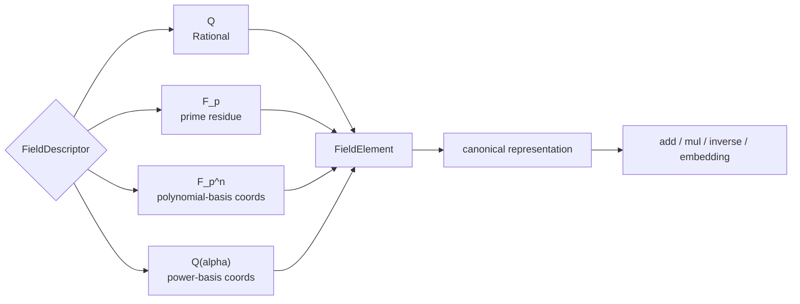

# 域与有限域

## 域对象和元素表示

| 域 | `FieldElementRepr` 的含义 | canonical 规则 |
|---|---|---|
| `Q` | numerator / denominator | 正分母、约分 |
| `F_p` | residue | Euclidean reduction modulo prime |
| `F_{p^n}` | basis coordinates | 固定长度并按 irreducible modulus 约化 |
| `Q(alpha)` | rational coordinates | 按 minimal polynomial 约化 |

`execute_field_with_table_mut` 用于需要登记 embedding 或 automorphism 的操作。跨域运算只能经过 `apply_prime_subfield_embedding`、`apply_base_field_embedding` 或已验证的 `FieldEmbedding`。两个表示相似的元素若 parent 不同，仍然返回 field mismatch。

源码顺序：`types.rs` 定义域和元素，`canonical.rs` 实现规范化与运算，`request.rs` 定义目标，`result.rs` 使用 `FieldTable` 分派，`value.rs` 封装领域结果。

`field` 实现有理数域、有限素域、有限扩张和数域的 typed 运算。每个元素都携带所属域，跨域操作不会静默转换。

## 公开入口

- `Field`、`FieldDescriptor`、`FieldElement` 与 `FieldElementRepr`
- `FieldRequest`、`FieldResult` 与 `FieldDomainValue`
- `canonical_rational`、`canonical_prime_residue`、`canonical_extension_element`
- `add_field_elements`、`mul_field_elements`、`inv_field_element`
- prime-subfield embedding、field embedding 与 automorphism

`execute_field` 负责领域请求，带 table 的变体用于复用 session 中的 parent、元素和映射。

## 语义与边界

`ℚ`、`𝔽_p`、`𝔽_{p^n}` 和 `ℚ(α)` 是不同的域对象。模数、表示和精确性必须由 `FieldElement` 的 parent 描述。`Z/mZ` 不因模数碰巧为素数就自动升级成有限域。域论不负责多项式算法、源语言解析或前端格式化。

## 相关模块

扩张和共享 parent 来自 `algebra`，Galois 性质由 `galois` 组织，多项式系数环由 `polynomial` 使用。跨域转换应通过显式 embedding 和可验证的 map 记录。
