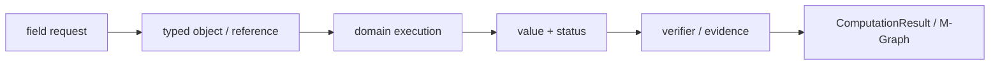
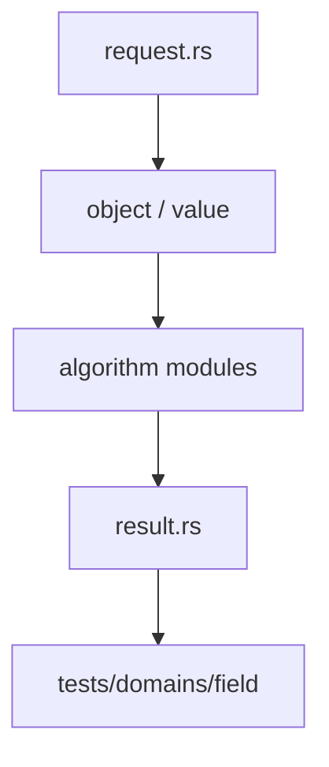

# 域与有限域

`field` 实现有理数域、有限素域、有限扩张和数域的 typed 运算。每个元素都携带所属域，跨域操作不会静默转换。

## 公开入口

- `Field`、`FieldDescriptor`、`FieldElement` 与 `FieldElementRepr`
- `FieldRequest`、`FieldResult` 与 `FieldDomainValue`
- `canonical_rational`、`canonical_prime_residue`、`canonical_extension_element`
- `add_field_elements`、`mul_field_elements`、`inv_field_element`
- prime-subfield embedding、field embedding 与 automorphism

`execute_field` 负责领域请求，带 table 的变体用于复用 session 中的 parent、元素和映射。

## 语义与边界

`ℚ`、`𝔽_p`、`𝔽_{p^n}` 和 `ℚ(α)` 是不同的域对象。模数、表示和精确性必须由 `FieldElement` 的 parent 描述。`Z/mZ` 不因模数碰巧为素数就自动升级成有限域。域论不负责多项式算法、源语言解析或前端格式化。

## 相关模块

扩张和共享 parent 来自 `algebra`，Galois 性质由 `galois` 组织，多项式系数环由 `polynomial` 使用。跨域转换应通过显式 embedding 和可验证的 map 记录。

## 架构图

## 合同表

| 阶段 | 输入 | 输出 | 必须保留 |
|---|---|---|---|
| 构造 | domain object、parent、scope | typed reference | identity、revision |
| 计划 | request、limits、capability | domain plan | algorithm、budget |
| 执行 | canonical representation | value、candidate 或 frontier | provenance、diagnostic |
| 验证 | value、certificate、dependencies | accepted claim 或 reject | replay evidence |
| 发布 | verified result | structured result | status、coverage、conditions |

## 源码阅读顺序

先读 `request.rs`，确认输入的身份和资源字段。再读对象/值模块，确认 payload、parent 和生命周期。随后读算法实现，最后读 `result.rs` 与测试，核对成功、失败和资源受限分支。

## 结果与证据

| 情况 | 结果状态 | 可以做什么 |
|---|---|---|
| 独立验证通过 | `Exact` 或 `Verified` | 按证书保证继续组合 |
| 依赖假设或分支 | `Conditional` | 携带条件继续查询 |
| 只得到候选 | `Candidate` | 等待 verifier，不得准入 |
| 算法被预算截断 | `Partial` / `ResourceLimited` | 保存 frontier 后恢复 |
| 输入或能力不满足 | `Invalid` / `Unknown` | 读取结构化诊断 |

证据不是日志字段。它必须能说明输入对象、算法前置条件、依赖关系和重放方式。缓存只能复用计算产物，不能代替验证和准入。

## 测试矩阵

| 测试层 | 必须证明 |
|---|---|
| 对象与规范化 | identity、parent、canonical form |
| 算法 | 正常值、边界值、域不匹配、除零或无解 |
| 结果 | payload、status、coverage、diagnostic |
| 资源 | budget、取消、frontier、resume |
| 证据 | replay、冲突、candidate 与 admission |

## 明确边界

本模块不解析源文本，不负责 UI、render、N-API 或平台对象。跨领域调用必须使用显式 capability、embedding 或 TypedView，并保留来源 fingerprint 与 revision。新增算法必须同步新增结果状态、失败路径和测试，不得只增加一个函数名。
