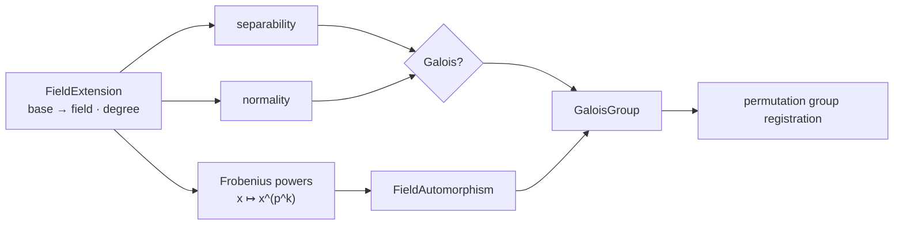

# 伽罗瓦理论

## 问题：扩张的对称性从哪里来

伽罗瓦计算从一个已登记的 `FieldExtension` 开始，而不是从多项式名称猜群。有限域扩张中，Frobenius 作用给出可执行自同构，正规性与可分性决定这些自同构是否组成所求伽罗瓦群。

| 问题 | 所需表示 | 当前处理 |
|---|---|---|
| 扩张是否可分 | minimal/irreducible polynomial 与 characteristic | `is_extension_separable` |
| 扩张是否正规 | 扩张 presentation | `is_extension_normal` |
| 自同构如何作用 | polynomial-basis coordinates | `apply_frobenius_coords` |
| 群如何表示 | automorphism 对基/根的置换 | `GroupTable` 中的循环群 |

`execute_galois_with_tables` 同时需要 `FieldTable` 与 `GroupTable`，因为答案跨越域和群两个对象系统。域表保存扩张、坐标和 automorphism map，群表保存生成元、群阶和 presentation。固定域或一般特征零扩张若缺少足够表示，结果保持 unevaluated。

源码阅读：[request.rs](./request.rs) → [compute.rs](./compute.rs) → [../algebra/galois_field.rs](../algebra/galois_field.rs) → [value.rs](./value.rs) / [result.rs](./result.rs)。测试见 [extension tower Galois tests](../../../tests/domains/algebra/extension_tower_galois.rs)。

`galois` 在已登记的域扩张上计算正规性、可分性、自同构与伽罗瓦群。它复用 `algebra` 的扩张和有限域表示，不复制域对象。

## 公开入口

`GaloisRequest` 描述目标，`execute_galois` 和 `execute_galois_with_tables` 执行请求。结果通过 `GaloisResult`、`GaloisComputation`、`GaloisDomainValue`、`FieldAutomorphism` 与 `GaloisGroup` 返回。

当前路径覆盖有限扩张上的 Frobenius、自同构、`is_extension_normal`、`is_extension_separable`、`is_galois_extension` 以及循环群等基础结构。多项式自动推导和固定域的完整入口仍按结果状态报告。

## 边界

伽罗瓦结论必须引用扩张 parent、表示和证据。模块不把未验证候选当作 exact，也不负责 polynomial ring 的长期存储。跨域运算经 `field` 的显式 embedding。

## 测试

扩张塔、Frobenius 和域表合同位于 `projects/athena-engine/tests/domains/algebra/`。
