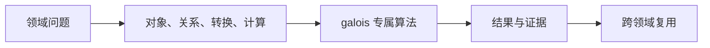
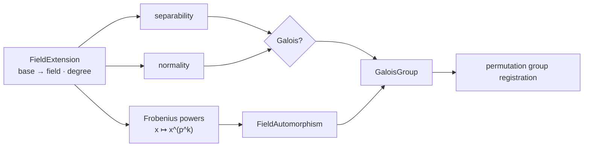

# 伽罗瓦理论

## 模块解决的问题

给定一个已登记的域扩张，模块要回答它是否可分、是否正规、有哪些自同构，以及这些自同构如何组成群。

## 交叉问题

field 提供扩张坐标和模多项式，algebra 提供 Frobenius map，group 保存自同构生成的 permutation presentation。缺少任何一层都不能可靠构造 GaloisGroup。

## 处理流

GaloisRequest 解析 ExtensionId，先计算 separable/normal 状态，再生成 Frobenius powers，登记 FieldAutomorphism，最后把自同构映射为群对象并返回 GaloisResult。

## 问题：扩张的对称性从哪里来

伽罗瓦计算从一个已登记的 `FieldExtension` 开始，而不是从多项式名称猜群。有限域扩张中，Frobenius 作用给出可执行自同构，正规性与可分性决定这些自同构是否组成所求伽罗瓦群。

| 问题 | 所需表示 | 当前处理 |
|---|---|---|
| 扩张是否可分 | minimal/irreducible polynomial 与 characteristic | `is_extension_separable` |
| 扩张是否正规 | 扩张 presentation | `is_extension_normal` |
| 自同构如何作用 | polynomial-basis coordinates | `apply_frobenius_coords` |
| 群如何表示 | automorphism 对基/根的置换 | `GroupTable` 中的循环群 |

`execute_galois_with_tables` 同时需要 `FieldTable` 与 `GroupTable`，因为答案跨越域和群两个对象系统。域表保存扩张、坐标和 automorphism map，群表保存生成元、群阶和 presentation。固定域或一般特征零扩张若缺少足够表示，结果保持 unevaluated。

源码阅读：[request.rs](./request.rs) → [compute.rs](./compute.rs) → [../algebra/galois_field.rs](../algebra/galois_field.rs) → [value.rs](./value.rs) / [result.rs](./result.rs)。测试见 [extension tower Galois tests](../../../tests/domains/algebra/extension_tower_galois.rs)。

`galois` 在已登记的域扩张上计算正规性、可分性、自同构与伽罗瓦群。它复用 `algebra` 的扩张和有限域表示，不复制域对象。

## 公开入口

`GaloisRequest` 描述目标，`execute_galois` 和 `execute_galois_with_tables` 执行请求。结果通过 `GaloisResult`、`GaloisComputation`、`GaloisDomainValue`、`FieldAutomorphism` 与 `GaloisGroup` 返回。

当前路径覆盖有限扩张上的 Frobenius、自同构、`is_extension_normal`、`is_extension_separable`、`is_galois_extension` 以及循环群等基础结构。多项式自动推导和固定域的完整入口仍按结果状态报告。

## 边界

伽罗瓦结论必须引用扩张 parent、表示和证据。模块不把未验证候选当作 exact，也不负责 polynomial ring 的长期存储。跨域运算经 `field` 的显式 embedding。

## 测试

扩张塔、Frobenius 和域表合同位于 `projects/athena-engine/tests/domains/algebra/`。

## 与源码和测试的对应

[request.rs](./request.rs) 定义目标，[compute.rs](./compute.rs) 组织计算，[../algebra/galois_field.rs](../algebra/galois_field.rs) 执行扩张性质和 Frobenius，[result.rs](./result.rs) / [value.rs](./value.rs) 发布对象。测试要覆盖同一扩张的重复查询、Frobenius power 组合、不可分扩张、非正规扩张和 group registration。任何“按 degree 猜群”的快捷路径都应被测试拒绝。

## 深入理解

Frobenius 不是一个显示名称，而是坐标上的可执行变换。对 polynomial-basis element，模块计算每个坐标在 p 次幂下的结果，再按扩张 modulus 约化。重复作用的 power 对应自同构组合，只有在扩张可分且正规时，才可把这些自同构组织成完整伽罗瓦群。

`FieldAutomorphism` 保存扩张、Frobenius power 和 map id，`GaloisGroup` 保存生成元与群 presentation。这样下游 group 可以做成员判定，field 仍能应用自同构到具体元素。缺少正规性证据时，结果只能是 property state，不能伪装成群对象。

## 失败路径与验证

扩张 descriptor 不完整、Frobenius power 超出合法范围、modulus 不可约或 base field 不匹配时，结果必须保留 diagnostic。`is_extension_separable` 和 `is_extension_normal` 是独立性质，不能用 `degree > 0` 猜测。构造 GaloisGroup 前要确认自同构映射闭合，生成元在 GroupTable 中可验证。

## 维护者阅读清单

修改 `compute.rs` 必须同时检查 field table 与 group table 的生命周期。修改 `galois_field.rs` 要检查 coordinate multiplication、Frobenius 和 automorphism map 的一致性。新增扩张算法时必须说明它需要哪些 presentation、是否产出 complete group，以及不能回答时的结果状态。

## 为什么伽罗瓦群不能从次数推断

相同扩张次数可能对应不同的正规性、可分性和自同构结构。只有扩张的 presentation、Frobenius 作用和 map verification 都可用，才能登记 GaloisGroup。群的阶、生成元和 presentation 是计算产物，不是由 degree 单独推出的标签。

伽罗瓦结果的价值在于可组合：field 可以把 automorphism 应用到元素，group 可以查询生成元与阶，polynomial 可以在已有扩张中继续处理根。若某一步只返回一个名称而没有 map、extension 和 verification，后续领域不能安全复用。

这也是为什么 `GaloisComputation` 必须保留 domain value 和 property state。调用方需要知道得到的是扩张性质、一个自同构、一个群 presentation，还是尚未完成的候选，而不是只看到一个统一的字符串结果。

这些状态也是跨域 planner 判断是否可以继续的依据。

没有这些状态，Galois 只能成为展示层名称，无法参与可验证计算。

它们还决定结果能否作为后续 polynomial、group 或 solve 目标的输入。

因此结果对象必须携带扩张引用、自同构引用和 property state，而不是只提供群阶。

阅读实现时，应先确认扩张对象的 base、field、degree 和 embedding，再跟踪 Frobenius 坐标如何经过有限域 kernel。只有坐标变换、映射登记和群生成元三者一致，结果才可进入后续证明或缓存。
