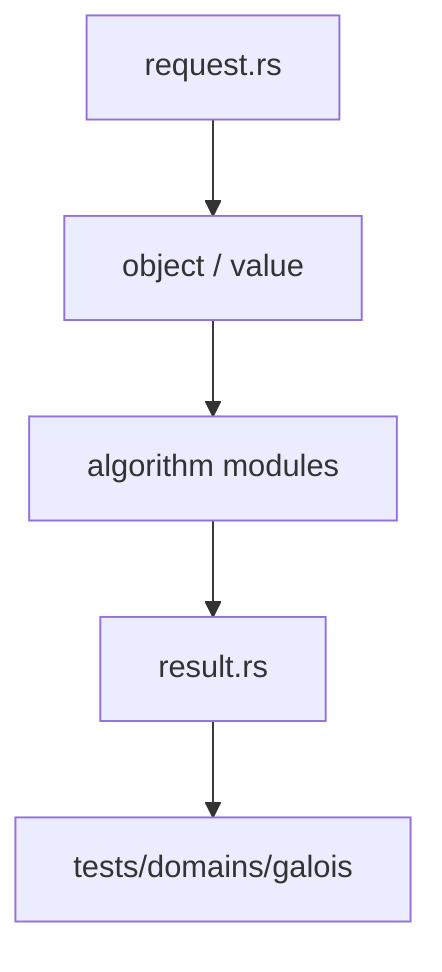

# 伽罗瓦理论

`galois` 在已登记的域扩张上计算正规性、可分性、自同构与伽罗瓦群。它复用 `algebra` 的扩张和有限域表示，不复制域对象。

## 公开入口

`GaloisRequest` 描述目标，`execute_galois` 和 `execute_galois_with_tables` 执行请求。结果通过 `GaloisResult`、`GaloisComputation`、`GaloisDomainValue`、`FieldAutomorphism` 与 `GaloisGroup` 返回。

当前路径覆盖有限扩张上的 Frobenius、自同构、`is_extension_normal`、`is_extension_separable`、`is_galois_extension` 以及循环群等基础结构。多项式自动推导和固定域的完整入口仍按结果状态报告。

## 边界

伽罗瓦结论必须引用扩张 parent、表示和证据。模块不把未验证候选当作 exact，也不负责 polynomial ring 的长期存储。跨域运算经 `field` 的显式 embedding。

## 测试

扩张塔、Frobenius 和域表合同位于 `projects/athena-engine/tests/domains/algebra/`。

## 架构图

## 合同表

| 阶段 | 输入 | 输出 | 必须保留 |
|---|---|---|---|
| 构造 | domain object、parent、scope | typed reference | identity、revision |
| 计划 | request、limits、capability | domain plan | algorithm、budget |
| 执行 | canonical representation | value、candidate 或 frontier | provenance、diagnostic |
| 验证 | value、certificate、dependencies | accepted claim 或 reject | replay evidence |
| 发布 | verified result | structured result | status、coverage、conditions |

## 源码阅读顺序

先读 `request.rs`，确认输入的身份和资源字段。再读对象/值模块，确认 payload、parent 和生命周期。随后读算法实现，最后读 `result.rs` 与测试，核对成功、失败和资源受限分支。

## 结果与证据

| 情况 | 结果状态 | 可以做什么 |
|---|---|---|
| 独立验证通过 | `Exact` 或 `Verified` | 按证书保证继续组合 |
| 依赖假设或分支 | `Conditional` | 携带条件继续查询 |
| 只得到候选 | `Candidate` | 等待 verifier，不得准入 |
| 算法被预算截断 | `Partial` / `ResourceLimited` | 保存 frontier 后恢复 |
| 输入或能力不满足 | `Invalid` / `Unknown` | 读取结构化诊断 |

证据不是日志字段。它必须能说明输入对象、算法前置条件、依赖关系和重放方式。缓存只能复用计算产物，不能代替验证和准入。

## 测试矩阵

| 测试层 | 必须证明 |
|---|---|
| 对象与规范化 | identity、parent、canonical form |
| 算法 | 正常值、边界值、域不匹配、除零或无解 |
| 结果 | payload、status、coverage、diagnostic |
| 资源 | budget、取消、frontier、resume |
| 证据 | replay、冲突、candidate 与 admission |

## 明确边界

本模块不解析源文本，不负责 UI、render、N-API 或平台对象。跨领域调用必须使用显式 capability、embedding 或 TypedView，并保留来源 fingerprint 与 revision。新增算法必须同步新增结果状态、失败路径和测试，不得只增加一个函数名。
