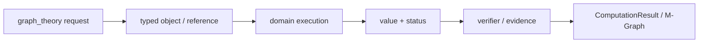
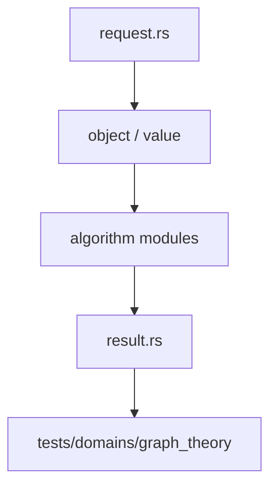

# 图论领域

`graph_theory` 在 `athena-graph` 的普通图存储之上提供图论语义、算法结果和证书。它属于 `athena-engine`，不是独立的图论 crate。

## 能力

- 连通分量、强连通分量与二分图判定
- 最短路径、生成森林和相关权重域
- `GraphDomainSemantics`、`GraphPresentation` 与 `GraphProvenance`
- 图 revision、snapshot、residency controller 和可恢复 checkpoint
- `GraphCertificate`、`GraphPropertyKind` 与 `GraphPropertyState`

入口请求是 `GraphTheoryRequest`，结果通过 `GraphTheoryResult` 及各算法结果类型返回。图的逻辑身份由 `GraphId`、`GraphRevision`、`GraphNodeId` 和 `GraphHandle` 共同描述。

## 边界

CSR/CSC、chunk 和存储视图属于 `athena-graph`。本模块负责数学算法、性质和证书，不发布 M-Graph claim。图的驻留、pin 与可达性是不同概念，算法被资源截断时必须保留 checkpoint 和状态。

## 测试

领域行为、生命周期和恢复测试位于 `projects/athena-engine/tests/domains/graph_theory/`。

## 架构图

## 合同表

| 阶段 | 输入 | 输出 | 必须保留 |
|---|---|---|---|
| 构造 | domain object、parent、scope | typed reference | identity、revision |
| 计划 | request、limits、capability | domain plan | algorithm、budget |
| 执行 | canonical representation | value、candidate 或 frontier | provenance、diagnostic |
| 验证 | value、certificate、dependencies | accepted claim 或 reject | replay evidence |
| 发布 | verified result | structured result | status、coverage、conditions |

## 源码阅读顺序

先读 `request.rs`，确认输入的身份和资源字段。再读对象/值模块，确认 payload、parent 和生命周期。随后读算法实现，最后读 `result.rs` 与测试，核对成功、失败和资源受限分支。

## 结果与证据

| 情况 | 结果状态 | 可以做什么 |
|---|---|---|
| 独立验证通过 | `Exact` 或 `Verified` | 按证书保证继续组合 |
| 依赖假设或分支 | `Conditional` | 携带条件继续查询 |
| 只得到候选 | `Candidate` | 等待 verifier，不得准入 |
| 算法被预算截断 | `Partial` / `ResourceLimited` | 保存 frontier 后恢复 |
| 输入或能力不满足 | `Invalid` / `Unknown` | 读取结构化诊断 |

证据不是日志字段。它必须能说明输入对象、算法前置条件、依赖关系和重放方式。缓存只能复用计算产物，不能代替验证和准入。

## 测试矩阵

| 测试层 | 必须证明 |
|---|---|
| 对象与规范化 | identity、parent、canonical form |
| 算法 | 正常值、边界值、域不匹配、除零或无解 |
| 结果 | payload、status、coverage、diagnostic |
| 资源 | budget、取消、frontier、resume |
| 证据 | replay、冲突、candidate 与 admission |

## 明确边界

本模块不解析源文本，不负责 UI、render、N-API 或平台对象。跨领域调用必须使用显式 capability、embedding 或 TypedView，并保留来源 fingerprint 与 revision。新增算法必须同步新增结果状态、失败路径和测试，不得只增加一个函数名。
