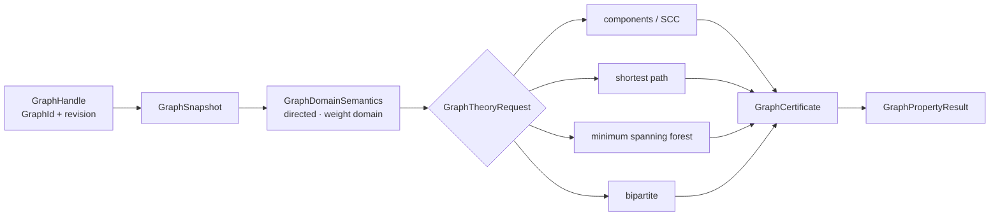

# 图论领域

## 问题：图的存储状态不等于数学结论

图论模块把 `athena-graph` 的 snapshot 和 CSR/CSC 原语提升为带 revision、权重域、算法证书和恢复状态的数学对象。

| 算法 | 依赖的表示 | 证书或结果 |
|---|---|---|
| connected components | snapshot adjacency | component partition |
| SCC | directed adjacency | strongly connected partition |
| shortest path | weight domain + source/target | path、distance、predecessor evidence |
| minimum spanning forest | undirected weighted edges | spanning edges、total weight |
| bipartite | vertex coloring | partition / odd-cycle failure evidence |

图对象的 `GraphRevision` 是算法输入的一部分。对旧 revision 生成的证书不能用于新 snapshot。`GraphResidencyController`、algorithm checkpoint 和 resume 处理 out-of-core 或资源截断，驻留变化不会改变逻辑图身份。

跨领域读取通过 [GraphMatrixView](../views/graph_matrix.rs) 提供 adjacency 投影，图论结论仍由本模块验证。源码阅读：[object.rs](./object.rs) / [lifecycle.rs](./lifecycle.rs) → [connectivity.rs](./connectivity.rs) / [path.rs](./path.rs) / [mst.rs](./mst.rs) / [bipartite.rs](./bipartite.rs) → [property.rs](./property.rs) / [result.rs](./result.rs)。测试见 [graph theory tests](../../../tests/domains/graph_theory/)。

`graph_theory` 在 `athena-graph` 的普通图存储之上提供图论语义、算法结果和证书。它属于 `athena-engine`，不是独立的图论 crate。

## 能力

- 连通分量、强连通分量与二分图判定
- 最短路径、生成森林和相关权重域
- `GraphDomainSemantics`、`GraphPresentation` 与 `GraphProvenance`
- 图 revision、snapshot、residency controller 和可恢复 checkpoint
- `GraphCertificate`、`GraphPropertyKind` 与 `GraphPropertyState`

入口请求是 `GraphTheoryRequest`，结果通过 `GraphTheoryResult` 及各算法结果类型返回。图的逻辑身份由 `GraphId`、`GraphRevision`、`GraphNodeId` 和 `GraphHandle` 共同描述。

## 边界

CSR/CSC、chunk 和存储视图属于 `athena-graph`。本模块负责数学算法、性质和证书，不发布 M-Graph claim。图的驻留、pin 与可达性是不同概念，算法被资源截断时必须保留 checkpoint 和状态。

## 测试

领域行为、生命周期和恢复测试位于 `projects/athena-engine/tests/domains/graph_theory/`。
