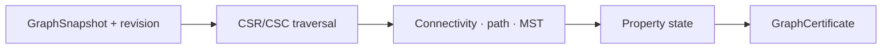
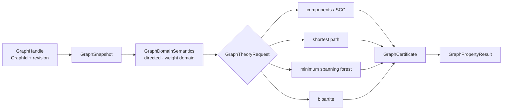

# 图论领域

## 带版本边界的图论结论

图论模块要把存储中的边集合变成带方向、权重、revision 和证书的数学对象。CSR 能加速访问，但本身不能证明最短路或生成树。

## 交叉领域协作

athena-graph 持有 snapshot，views 可提供 GraphMatrixView，linear_algebra 消费矩阵投影，M-Graph 保存已验证性质。

## 图快照如何生成可复核结论

GraphTheoryRequest 绑定 GraphRevision，检查权重域和驻留能力，运行连通性、SCC、路径、MST 或二分算法，生成 GraphCertificate 并发布结果。

## 问题：图的存储状态不等于数学结论

图论模块把 `athena-graph` 的 snapshot 和 CSR/CSC 原语提升为带 revision、权重域、算法证书和恢复状态的数学对象。

| 算法 | 依赖的表示 | 证书或结果 |
|---|---|---|
| connected components | snapshot adjacency | component partition |
| SCC | directed adjacency | strongly connected partition |
| shortest path | weight domain + source/target | path、distance、predecessor evidence |
| minimum spanning forest | undirected weighted edges | spanning edges、total weight |
| bipartite | vertex coloring | partition / odd-cycle failure evidence |

图对象的 `GraphRevision` 是算法输入的一部分。对旧 revision 生成的证书不能用于新 snapshot。`GraphResidencyController`、algorithm checkpoint 和 resume 处理 out-of-core 或资源截断，驻留变化不会改变逻辑图身份。

跨领域读取通过 [GraphMatrixView](../views/graph_matrix.rs) 提供 adjacency 投影，图论结论仍由本模块验证。源码阅读：[object.rs](./object.rs) / [lifecycle.rs](./lifecycle.rs) → [connectivity.rs](./connectivity.rs) / [path.rs](./path.rs) / [mst.rs](./mst.rs) / [bipartite.rs](./bipartite.rs) → [property.rs](./property.rs) / [result.rs](./result.rs)。测试见 [graph theory tests](../../../tests/domains/graph_theory/)。

`graph_theory` 在 `athena-graph` 的普通图存储之上提供图论语义、算法结果和证书。它属于 `athena-engine`，属于 `athena-engine` 的图论语义层。

## 能力

- 连通分量、强连通分量与二分图判定
- 最短路径、生成森林和相关权重域
- `GraphDomainSemantics`、`GraphPresentation` 与 `GraphProvenance`
- 图 revision、snapshot、residency controller 和可恢复 checkpoint
- `GraphCertificate`、`GraphPropertyKind` 与 `GraphPropertyState`

入口请求是 `GraphTheoryRequest`，结果通过 `GraphTheoryResult` 及各算法结果类型返回。图的逻辑身份由 `GraphId`、`GraphRevision`、`GraphNodeId` 和 `GraphHandle` 共同描述。

## 边界

CSR/CSC、chunk 和存储视图属于 `athena-graph`。本模块负责数学算法、性质和证书，不发布 M-Graph claim。图的驻留、pin 与可达性是不同概念，算法被资源截断时必须保留 checkpoint 和状态。

## 测试

领域行为、生命周期和恢复测试位于 `projects/athena-engine/tests/domains/graph_theory/`。

## 与源码和测试的对应

[object.rs](./object.rs) 先定义 graph semantics 和 provenance，[lifecycle.rs](./lifecycle.rs) 定义 residency/checkpoint，[connectivity.rs](./connectivity.rs)、[path.rs](./path.rs)、[mst.rs](./mst.rs) 和 [bipartite.rs](./bipartite.rs) 实现算法，[property.rs](./property.rs) / [result.rs](./result.rs) 定义证书。测试必须覆盖空图、revision 失效、负权、方向冲突、资源截断和恢复后的证书一致性。

## 深入理解

图算法的核心输入是 snapshot，而不是可变图句柄。`GraphRevision` 使算法结果具备时间边界：同一 GraphId 在边修改后产生的新 revision 不得复用旧路径或旧生成树证书。权重域也必须显式绑定，因为整数最短路和机器浮点最短路的保证不同。

连通性算法返回分区，SCC 返回有向闭包，MST 返回边集与总权重，二分算法返回 coloring 或冲突环。每种结果都可被 verifier 重放。out-of-core 时 checkpoint 只保存算法 frontier，不能把 chunk residency 当成图的逻辑状态。

## 失败路径与验证

空图、孤立点、重复边、自环、负权和方向冲突都必须走显式分支。最短路不能在负权输入上假装使用非负权算法，MST 不能接收有向图，二分结果必须能区分成功 coloring 和 odd-cycle witness。算法 checkpoint 还要包含 graph revision，恢复时先检查 snapshot 是否仍然相同。

## 维护者阅读清单

修改 `object.rs` 要检查 GraphId、revision、weight domain 和 provenance。修改 `lifecycle.rs` 要检查 residency、pin、checkpoint 与 resume。修改算法文件要同步 property state、certificate 和 graph theory result。跨到线代时只能通过 GraphMatrixView，不能在算法内偷偷创建第二个逻辑矩阵对象。

## 为什么图算法需要自己的语义层

`athena-graph` 解决存储和基础遍历，graph_theory 解决“这个遍历是否证明了一个数学性质”。前者关心 chunk、CSR 和 snapshot，后者关心 directed/undirected、weight domain、certificate 和 property state。两层分开，才能让存储优化不改变数学结论。

图论结果还要说明算法观察的是哪一个 snapshot。相同 GraphId 的两个 revision 不能共享 path predecessor、component label 或 spanning edge certificate。这个约束使图存储可以进行 chunk eviction，而不会让缓存把旧图上的结论传播到新图。
