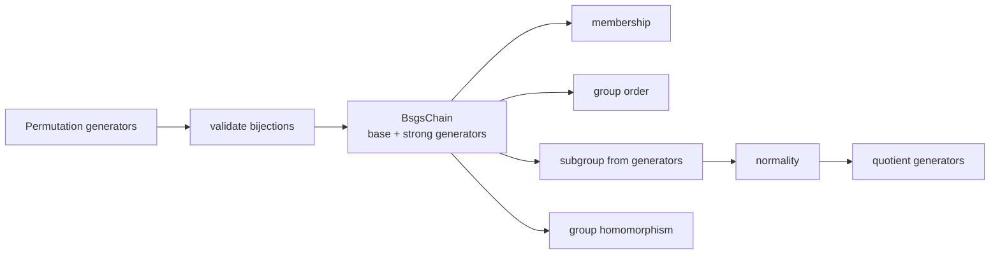

# 群论

## 问题：怎样计算一个抽象群

Athena 当前用置换表示把群运算变成可执行问题：生成元作用在有限点集上，BSGS 链提供成员判定和群阶，子群与陪集进一步产生商群和同态。

| 表示 | 为什么使用 | 支持的计算 |
|---|---|---|
| `Permutation.images` | 有限、可验证、组合与逆明确 | 乘法、逆、作用 |
| `BsgsChain` | 避免枚举整个群完成成员判定 | contains、order、元素生成 |
| `SubgroupId` | 绑定 parent group | normality、coset、quotient |
| `AlgebraMapId` | 固定同态 source/target | image、projection、inclusion |

`GroupElement` 必须绑定 `GroupId`。相同 permutation images 在不同群里不是同一个元素。商群只有在正规性验证后才能登记 quotient projection，同态需要验证生成元关系后写入 `MapTable`。

跨领域上，Galois 模块把域自同构组织成 permutation group，多项式与数域计算可查询群性质，但群模块不拥有域元素。源码阅读：[types.rs](./types.rs) → [canonical.rs](./canonical.rs) → [../algebra/bsgs.rs](../algebra/bsgs.rs) → [../algebra/group_table.rs](../algebra/group_table.rs) → [result.rs](./result.rs)。测试见 [algebra/group tests](../../../tests/domains/algebra/)。

`group` 提供有限群和置换群的 typed 对象、元素运算与请求分派。元素携带所属群身份，跨群运算返回 `ATHENA_GROUP_MISMATCH` 类结构化诊断。

## 公开入口

- `Group`、`GroupDescriptor`、`GroupElement`、`Permutation`、`Subgroup`
- `GroupRequest`、`GroupResult` 与 `GroupDomainValue`
- `canonical_permutation`、`multiply_group_elements`、`inverse_group_element`
- `group_membership`、`apply_group_homomorphism` 与 `project_quotient_element`
- `execute_group` 及带 table 的执行变体

当前实现围绕置换 presentation、BSGS、子群、同态和商结构。抽象群的完整 Cayley 表和更广泛的群算法按结果状态逐步加入。

## 边界

共享 parent、映射和 fingerprint 来自 `algebra`。群请求不解析文本，不复制 solver 调度协议，也不把群元素降级成无类型整数。证书和关系准入由 engine reasoning 层统一处理。

## 测试

群与相关扩张合同位于 `projects/athena-engine/tests/domains/algebra/`。
