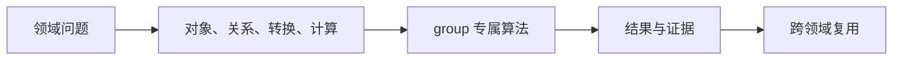
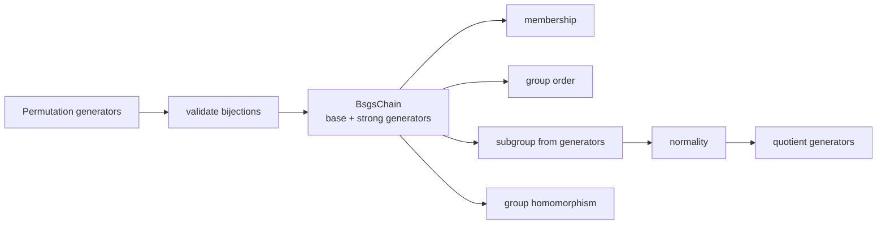

# 群论

## 模块解决的问题

群模块解决有限群的可计算表示问题：不枚举所有元素，也能进行成员判定、求群阶、构造子群和商群。

## 交叉问题

galois 把自同构交给 GroupTable，algebra 统一 parent 和 map，field 保留自同构作用的元素坐标。群模块不拥有域语义，只验证群结构。

## 处理流

GroupRequest 解析 GroupId，验证生成元是双射，建立 BsgsChain，按目标执行 membership、subgroup、homomorphism 或 quotient，并在 MapTable 中记录验证结果。

## 问题：怎样计算一个抽象群

Athena 当前用置换表示把群运算变成可执行问题：生成元作用在有限点集上，BSGS 链提供成员判定和群阶，子群与陪集进一步产生商群和同态。

| 表示 | 为什么使用 | 支持的计算 |
|---|---|---|
| `Permutation.images` | 有限、可验证、组合与逆明确 | 乘法、逆、作用 |
| `BsgsChain` | 避免枚举整个群完成成员判定 | contains、order、元素生成 |
| `SubgroupId` | 绑定 parent group | normality、coset、quotient |
| `AlgebraMapId` | 固定同态 source/target | image、projection、inclusion |

`GroupElement` 必须绑定 `GroupId`。相同 permutation images 在不同群里不是同一个元素。商群只有在正规性验证后才能登记 quotient projection，同态需要验证生成元关系后写入 `MapTable`。

跨领域上，Galois 模块把域自同构组织成 permutation group，多项式与数域计算可查询群性质，但群模块不拥有域元素。源码阅读：[types.rs](./types.rs) → [canonical.rs](./canonical.rs) → [../algebra/bsgs.rs](../algebra/bsgs.rs) → [../algebra/group_table.rs](../algebra/group_table.rs) → [result.rs](./result.rs)。测试见 [algebra/group tests](../../../tests/domains/algebra/)。

`group` 提供有限群和置换群的 typed 对象、元素运算与请求分派。元素携带所属群身份，跨群运算返回 `ATHENA_GROUP_MISMATCH` 类结构化诊断。

## 公开入口

- `Group`、`GroupDescriptor`、`GroupElement`、`Permutation`、`Subgroup`
- `GroupRequest`、`GroupResult` 与 `GroupDomainValue`
- `canonical_permutation`、`multiply_group_elements`、`inverse_group_element`
- `group_membership`、`apply_group_homomorphism` 与 `project_quotient_element`
- `execute_group` 及带 table 的执行变体

当前实现围绕置换 presentation、BSGS、子群、同态和商结构。抽象群的完整 Cayley 表和更广泛的群算法按结果状态逐步加入。

## 边界

共享 parent、映射和 fingerprint 来自 `algebra`。群请求不解析文本，不复制 solver 调度协议，也不把群元素降级成无类型整数。证书和关系准入由 engine reasoning 层统一处理。

## 测试

群与相关扩张合同位于 `projects/athena-engine/tests/domains/algebra/`。

## 与源码和测试的对应

[types.rs](./types.rs) 描述群和元素，[canonical.rs](./canonical.rs) 组织运算，[../algebra/bsgs.rs](../algebra/bsgs.rs) 与 [../algebra/group_table.rs](../algebra/group_table.rs) 管理强生成元和表，[result.rs](./result.rs) 发布结构化结果。测试必须覆盖 permutation validation、identity/inverse、BSGS membership、subgroup normality、quotient projection、homomorphism mismatch 和 parent fingerprint。

## 深入理解

BSGS 的价值在于把群阶和成员判定从“枚举全部元素”变成一组 stabilizer 层。`BsgsChain::contains` 逐层消解点轨道，`all_elements` 只在确实需要枚举时使用。子群通过同一表示构造，正规性通过共轭闭包检查，商群再依据陪集代表元生成。

同态不是两个 permutation 数组相等，而是生成元关系在 target 中仍成立。`MapTable` 因此保存 source、target、generator images 和 verification。Galois 使用这条路径注册自同构，Solve 或 polynomial 不应绕过它直接把群元素降成整数。

## 失败路径与验证

`RawPerm::new` 拒绝重复 image、越界 image 和 degree 不一致。BSGS 建链后必须验证强生成元关系，不能仅根据输入生成元数量猜群阶。子群 quotient 需要 normality，homomorphism 需要检查生成元关系，MapTable 中的 proven 状态是后续消费的前提。

## 维护者阅读清单

修改 permutation 表示要检查 BSGS、fingerprint 和所有 group element canonicalization。修改 subgroup 算法要检查 coset representatives 和 quotient order。修改群表要同步 Galois automorphism registration 和 field map。测试需要覆盖 identity、inverse、composition、membership、非正规子群和错误 source/target。

## 为什么 BSGS 是默认表示

完整 Cayley table 的大小随群阶增长，无法作为一般有限群的默认对象。BSGS 只保留基、轨道和强生成元，成员判定和群阶仍可在可控空间内计算。需要枚举时才调用 `all_elements`，并且必须受预算约束。

群模块的跨域出口是 map，而不是元素的内部整数。Galois 通过它登记 Frobenius 生成元，algebra 通过它保存 inclusion 和 quotient projection。任何绕过 `MapTable` 的转换都会让 source/target、验证状态和缓存依赖丢失，因此不能作为公共路径。

因此群结果可以被其它领域查询而不失去来源：群阶来自 BSGS chain，商群来自正规性证据，同态来自 generator-image verification。每个结果都能回到 parent 和 presentation，避免把一个 permutation 数组误解成任意抽象群。

这使群结果可被 Galois 和代数层安全地复用。

因此 group 的输出不仅是元素列表，也是带 parent 和证据的结构化数学对象。

这也是 BSGS、subgroup 和 quotient 可以被增量缓存的前提。

缓存键因此必须包含 group fingerprint 和 presentation。
