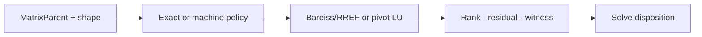
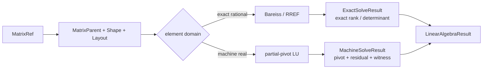
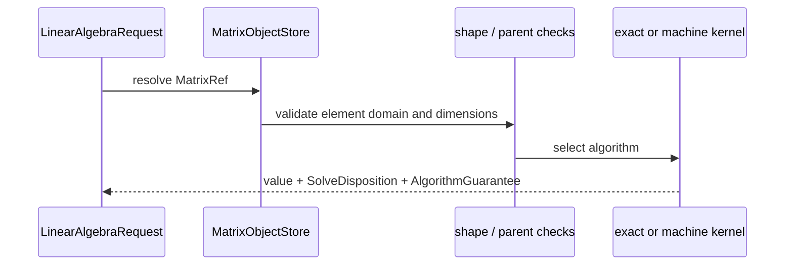

# 线性代数

## 精确与机器矩阵求解的契约

矩阵算法必须知道元素域、维度、布局和精度保证。该模块同时支持 exact rational 与 machine real，但两条路径的结论不能混在一起。

## 交叉领域协作

field 提供元素 parent，polynomial 的 F4 通过矩阵视图调用消元，graph 通过 TypedView 暴露邻接结构，solve 消费 rank、nullspace 和 disposition。

## 矩阵请求如何选择数值路径

LinearAlgebraRequest 解析 MatrixRef，检查 parent/shape/layout，选择 Bareiss 或 partial-pivot LU，生成解、秩、残差和 witness，再形成 LinearAlgebraResult。

## 矩阵表示与算法分流

| 层 | 类型 | 对算法的影响 |
|---|---|---|
| 身份 | `MatrixRef`、`MatrixParent` | 元素域和对象归属 |
| 维度 | `MatrixShape` | matmul、solve、slice 的合法性 |
| 布局 | `Layout`、`StorageOrder` | 索引和后端访问方式 |
| 精确路径 | `ExactRrefResult`、`ExactSolveResult` | exact guarantee、解空间 |
| 机器路径 | `MachineLuFactorization`、`MachineSolveWitness` | pivot threshold、误差与残差 |

## 处理流程

`det_bareiss`、`rank_exact`、`rref_rational` 和 `solve_exact` 不经机器浮点。`lu_partial_pivot`、`rank_machine` 和 `solve_machine` 必须暴露 pivot threshold 与 witness。欠定系统返回解空间信息，一个向量不能冒充完整解集。

| 操作 | 预检查 | 结果 |
|---|---|---|
| `matmul` | inner dimension、parent | 新矩阵 |
| `slice_matrix` | `IndexSpec`、一基边界 | 保留布局语义的切片 |
| exact solve | 精确域、shape | 唯一解、仿射族或不相容 |
| machine solve | pivot 与容差 | 近似解、残差、witness |

源码从 [parent.rs](./parent.rs) / [shape.rs](./shape.rs) / [value.rs](./value.rs) 开始，随后读 [ops.rs](./ops.rs) / [index.rs](./index.rs)，最后对照 [exact.rs](./exact.rs)、[machine.rs](./machine.rs)、[status.rs](./status.rs) 与 [result.rs](./result.rs)。

`linear_algebra` 负责矩阵身份、shape/layout、精确与机器数值路径，以及线性方程组的结果合同。

## 能力

- `MatrixValue`、`MatrixShape`、`Layout`、`MatrixRef` 和 parent
- `matmul`、`transpose`、`hadamard`、切片与一基索引
- 精确有理数路径：Bareiss 行列式、秩、RREF 和线性求解
- 机器路径：部分主元 LU、秩和求解
- `LinearAlgebraRequest`、`LinearAlgebraResult` 与 `LinearAlgebraValue`
- `AlgorithmGuarantee`、`SolveDisposition` 与 machine witness

精确路径和机器路径分别报告保证。机器浮点近似不能冒充 exact，也不能将一个特解冒充完整解空间。

## 边界

矩阵逻辑身份、domain、shape 和 view 与 `athena-ndarray` 的存储布局分开。数组 chunk、stride 和 out-of-core 生命周期由数组基础设施负责。方言 lowering 不在本模块。

## 测试

核心运算和结果合同位于 `projects/athena-engine/tests/domains/linear_algebra/`，矩阵对象与跨域 view 还需结合 `athena-ndarray` 测试检查。
## 请求与执行

`LinearAlgebraRequest` 在矩阵引用、shape、parent 和算法模式上保持显式。精确请求走 `rref_rational`、`rank_exact`、`det_bareiss` 或 `solve_exact`，机器请求走 `lu_partial_pivot`、`rank_machine` 或 `solve_machine`。结果通过 `LinearAlgebraResult` 区分精确证书、机器 witness、无解和资源状态。

## 文件地图

`parent.rs`/`shape.rs` 定义矩阵身份和布局，`object_ref.rs` 管理 session 引用，`exact.rs` 与 `machine.rs` 是两条算法路径，`ops.rs` 是矩阵操作，`index.rs` 负责一基索引和切片，`status.rs` 定义保证，`result.rs` 负责领域返回。

## 语义约束

矩阵运算前检查 parent、shape 和布局兼容性。机器 LU 的 pivot threshold、残差和 witness 必须可读取。pivot 失败或预算截断只能返回相应状态，不能降级为 exact rank 或完整 nullspace。

## 深入理解

矩阵 parent 说明元素域，shape 说明维度，layout 说明访问方式，三者不能用一个字符串替代。精确路径使用有理数消元，系数增长由 Bareiss 控制；machine 路径使用 partial pivot，并需要 threshold 和 residual 才能解释数值稳定性。

`solve_exact` 可能返回唯一解、参数族或不相容诊断，`solve_machine` 则返回 witness 和误差信息。polynomial 的 F4 使用矩阵作为暂时 kernel artifact，不能把 Macaulay 矩阵自身当成语义对象。graph 的邻接 view 同理，视图生命周期和矩阵逻辑身份必须分开。

## 为什么 exact 与 machine 必须分叉

Bareiss 的中间值增长和机器 LU 的舍入误差属于不同问题。若共用一个“矩阵结果”类型，调用方会误把近似残差当成代数证明。`AlgorithmGuarantee` 和 `SolveDisposition` 让 exact solution、machine approximate、inconsistent 和 underdetermined 在类型上保持可区分。
