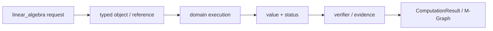
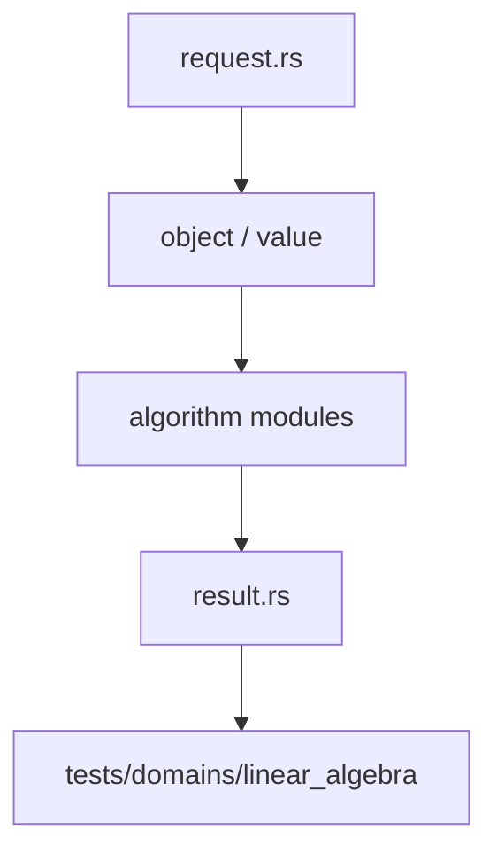

# 线性代数

`linear_algebra` 负责矩阵身份、shape/layout、精确与机器数值路径，以及线性方程组的结果合同。

## 能力

- `MatrixValue`、`MatrixShape`、`Layout`、`MatrixRef` 和 parent
- `matmul`、`transpose`、`hadamard`、切片与一基索引
- 精确有理数路径：Bareiss 行列式、秩、RREF 和线性求解
- 机器路径：部分主元 LU、秩和求解
- `LinearAlgebraRequest`、`LinearAlgebraResult` 与 `LinearAlgebraValue`
- `AlgorithmGuarantee`、`SolveDisposition` 与 machine witness

精确路径和机器路径分别报告保证。机器浮点近似不能冒充 exact，也不能将一个特解冒充完整解空间。

## 边界

矩阵逻辑身份、domain、shape 和 view 与 `athena-ndarray` 的存储布局分开。数组 chunk、stride 和 out-of-core 生命周期由数组基础设施负责。方言 lowering 不在本模块。

## 测试

核心运算和结果合同位于 `projects/athena-engine/tests/domains/linear_algebra/`，矩阵对象与跨域 view 还需结合 `athena-ndarray` 测试检查。
## 请求与执行

`LinearAlgebraRequest` 在矩阵引用、shape、parent 和算法模式上保持显式。精确请求走 `rref_rational`、`rank_exact`、`det_bareiss` 或 `solve_exact`，机器请求走 `lu_partial_pivot`、`rank_machine` 或 `solve_machine`。结果通过 `LinearAlgebraResult` 区分精确证书、机器 witness、无解和资源状态。

## 文件地图

`parent.rs`/`shape.rs` 定义矩阵身份和布局，`object_ref.rs` 管理 session 引用，`exact.rs` 与 `machine.rs` 是两条算法路径，`ops.rs` 是矩阵操作，`index.rs` 负责一基索引和切片，`status.rs` 定义保证，`result.rs` 负责领域返回。

## 语义约束

矩阵运算前检查 parent、shape 和布局兼容性。机器 LU 的 pivot threshold、残差和 witness 必须可读取。pivot 失败或预算截断只能返回相应状态，不能降级为 exact rank 或完整 nullspace。

## 架构图

## 合同表

| 阶段 | 输入 | 输出 | 必须保留 |
|---|---|---|---|
| 构造 | domain object、parent、scope | typed reference | identity、revision |
| 计划 | request、limits、capability | domain plan | algorithm、budget |
| 执行 | canonical representation | value、candidate 或 frontier | provenance、diagnostic |
| 验证 | value、certificate、dependencies | accepted claim 或 reject | replay evidence |
| 发布 | verified result | structured result | status、coverage、conditions |

## 源码阅读顺序

先读 `request.rs`，确认输入的身份和资源字段。再读对象/值模块，确认 payload、parent 和生命周期。随后读算法实现，最后读 `result.rs` 与测试，核对成功、失败和资源受限分支。重点顺序是 parent/shape → object_ref → exact 或 machine → result。

## 结果与证据

| 情况 | 结果状态 | 可以做什么 |
|---|---|---|
| 独立验证通过 | `Exact` 或 `Verified` | 按证书保证继续组合 |
| 依赖假设或分支 | `Conditional` | 携带条件继续查询 |
| 只得到候选 | `Candidate` | 等待 verifier，不得准入 |
| 算法被预算截断 | `Partial` / `ResourceLimited` | 保存 frontier 后恢复 |
| 输入或能力不满足 | `Invalid` / `Unknown` | 读取结构化诊断 |

证据不是日志字段。它必须能说明输入对象、算法前置条件、依赖关系和重放方式。缓存只能复用计算产物，不能代替验证和准入。

## 测试矩阵

| 测试层 | 必须证明 |
|---|---|
| 对象与规范化 | identity、parent、canonical form |
| 算法 | 正常值、边界值、域不匹配、除零或无解 |
| 结果 | payload、status、coverage、diagnostic |
| 资源 | budget、取消、frontier、resume |
| 证据 | replay、冲突、candidate 与 admission |

## 明确边界

本模块不解析源文本，不负责 UI、render、N-API 或平台对象。跨领域调用必须使用显式 capability、embedding 或 TypedView，并保留来源 fingerprint 与 revision。新增算法必须同步新增结果状态、失败路径和测试，不得只增加一个函数名。
