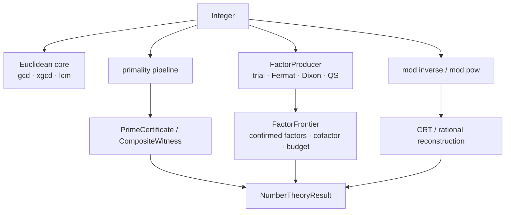
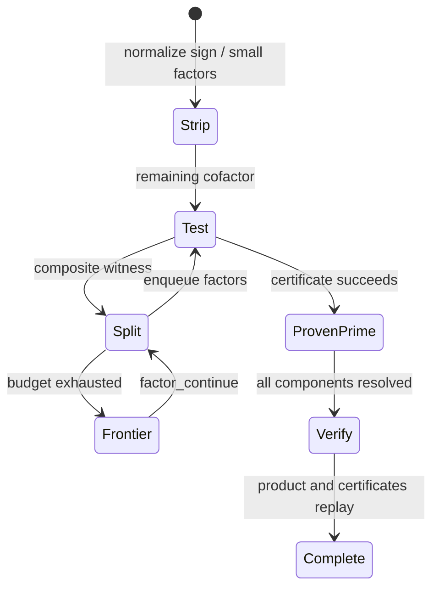

# 数论

## 可恢复的整数算术与分解

大整数分解逐步确认素因子、保存剩余 cofactor，并允许预算中断后继续。

## 交叉领域协作

numeric 提供 Integer 和模 kernel，field 提供 prime field，polynomial 使用模像与 CRT，M-Graph 复用经过验证的整除和素性事实。

## 算术请求如何累积证据

NumberTheoryRequest 先做 Euclidean 预处理，再进入 primality 或 factor producer，生成 certificate 或 FactorFrontier，最后 verify product 和 evidence 后发布结果。

## 从整数到可验证结论

| 对象 | 它回答的问题 | 完整性信息 |
|---|---|---|
| `Primality` | `n` 是素数、合数还是概率素数 | certificate、witness 或 base selection |
| `FactorComponent` | 某个因子及其指数 | prime/probable/composite 状态 |
| `Factorization` | 已确认因子与剩余 cofactor | `FactorizationCompleteness` |
| `FactorFrontier` | 分解从哪里继续 | producer、预算、待处理 cofactor |
| `CongruenceSolution` | 线性同余的解类 | residue 与 modulus |
| `RationalReconstruction` | residue 是否对应小有理数 | numerator、denominator、bound |

## 分解状态机

`factor_integer_with_producer` 允许替换 factor producer，但不能改变结果合同。`factor_continue` 必须消费已有 frontier。`verify_factorization` 会重新乘回因子，并核对 cofactor 与素性证据。概率 Miller–Rabin 结果只能保持 `Probable`。

## 算法族

| 家族 | 实现入口 | 典型失败或非完成态 |
|---|---|---|
| 整数算术 | `isqrt`、`perfect_power_decomposition`、Jacobi/Kronecker | 负输入或非完全幂 |
| Euclidean | `gcd`、`extended_gcd`、`lcm` | 仍返回精确 Bezout 关系 |
| 素性 | `primality_test` | probable、composite witness |
| 分解 | `fermat_split`、`dixon_split`、`qs_split` | frontier / resource limited |
| 模算术 | `mod_inverse`、`mod_pow` | modulus 非法、逆不存在 |
| 同余与重构 | `chinese_remainder`、`solve_linear_congruence`、`rational_reconstruction` | 非互素、不一致、超过界 |

源码顺序为 [gcd.rs](./gcd.rs) / [arithmetic](./arithmetic/) → [primes.rs](./primes.rs) / [certificates.rs](./certificates.rs) → [factor](./factor/) → [modular.rs](./modular.rs) / [congruence](./congruence/) → [result.rs](./result.rs)。测试位于 [number theory tests](../../../tests/domains/number_theory/)，其中 [factor_pipeline.rs](../../../tests/domains/number_theory/factor_pipeline.rs) 与 [quadratic_sieve.rs](../../../tests/domains/number_theory/quadratic_sieve.rs) 负责分解完整性和恢复路径。

`number_theory` 提供计算数论的精确例程、同余工具、素性与分解证据。结果使用 `NumberTheoryResult` 和 typed value，不让调用方从裸 `Vec` 猜测完整性。

## 能力

- `gcd`、`lcm`、extended GCD、整数平方根和完全幂
- Jacobi/Kronecker 符号、素数迭代与筛选
- 模幂、模逆、线性同余、CRT 与 rational reconstruction
- 因子分解、frontier、预算、继续执行与验证
- `PrimeCertificate`、`CompositeWitness`、概率素性证据

`NumberTheoryRequest` 是领域请求入口，`execute_number_theory` 返回 `NumberTheoryResult`。分解结果通过 `FactorizationCompleteness`、`FactorComponent` 和 `FactorFrontier` 表达覆盖范围与可恢复状态。

## 结果语义

`Prime`、`Probable`、`Composite`、`Partial` 和资源受限状态必须保持区分。概率性素性测试不能直接成为确定素数证书，未完成分解不能写成完整因式分解。

## 边界与测试

数值表示和预算来自 `athena-numeric`。代数数论对象仍在建设，`PAdicValue` 不等同于局部域。合同测试位于 `projects/athena-engine/tests/domains/number_theory/`。
## 请求与执行

`NumberTheoryRequest` 将 GCD、模运算、素性、因式分解、同余和重构区分为不同目标。结果通过 `NumberTheoryValue` 封装，并由 `FactorizationCompleteness`、`Primality` 或 `RationalReconstruction` 描述保证。

分解路径可暂停：`FactorFrontier` 记录待处理 cofactor、已确认因子、算法和预算。继续执行必须使用 frontier。

## 文件地图

`arithmetic.rs` 是平方根、符号和完全幂，`gcd.rs` 是 Euclidean 基础，`primes.rs` 与 `certificates.rs` 负责素性，`factor.rs` 负责分解和 frontier，`congruence.rs`/`modular.rs` 负责 CRT、模逆与重构，`request.rs`/`result.rs` 是领域边界。

## 验证规则

`verify_factorization` 重新计算乘积并检查素性证书。概率 Miller–Rabin 证据只能映射到 probable。资源耗尽保留已验证因子和剩余 cofactor，不能返回完整因式分解。
