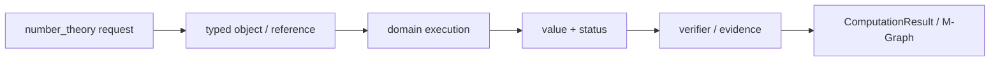
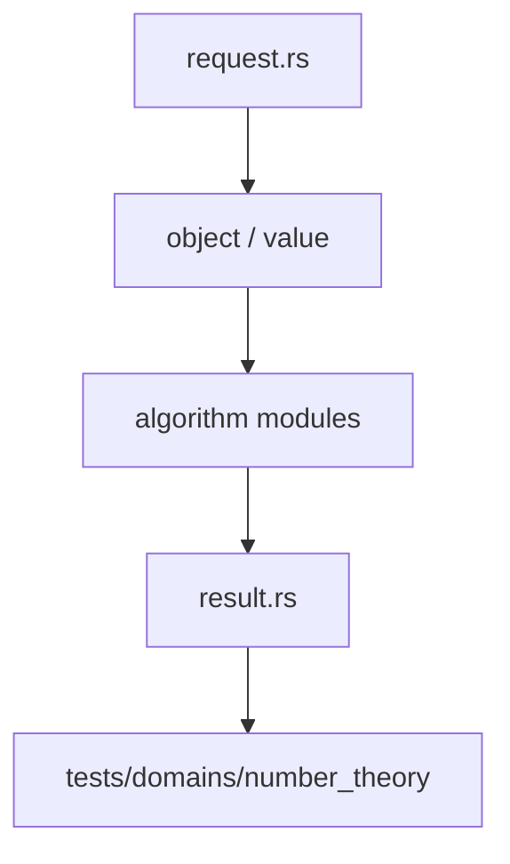

# 数论

`number_theory` 提供计算数论的精确例程、同余工具、素性与分解证据。结果使用 `NumberTheoryResult` 和 typed value，不让调用方从裸 `Vec` 猜测完整性。

## 能力

- `gcd`、`lcm`、extended GCD、整数平方根和完全幂
- Jacobi/Kronecker 符号、素数迭代与筛选
- 模幂、模逆、线性同余、CRT 与 rational reconstruction
- 因子分解、frontier、预算、继续执行与验证
- `PrimeCertificate`、`CompositeWitness`、概率素性证据

`NumberTheoryRequest` 是领域请求入口，`execute_number_theory` 返回 `NumberTheoryResult`。分解结果通过 `FactorizationCompleteness`、`FactorComponent` 和 `FactorFrontier` 表达覆盖范围与可恢复状态。

## 结果语义

`Prime`、`Probable`、`Composite`、`Partial` 和资源受限状态必须保持区分。概率性素性测试不能直接成为确定素数证书，未完成分解不能写成完整因式分解。

## 边界与测试

数值表示和预算来自 `athena-numeric`。代数数论对象仍在建设，`PAdicValue` 不等同于局部域。合同测试位于 `projects/athena-engine/tests/domains/number_theory/`。
## 请求与执行

`NumberTheoryRequest` 将 GCD、模运算、素性、因式分解、同余和重构区分为不同目标。结果通过 `NumberTheoryValue` 封装，并由 `FactorizationCompleteness`、`Primality` 或 `RationalReconstruction` 描述保证。

分解路径可暂停：`FactorFrontier` 记录待处理 cofactor、已确认因子、算法和预算。继续执行必须使用 frontier。

## 文件地图

`arithmetic.rs` 是平方根、符号和完全幂，`gcd.rs` 是 Euclidean 基础，`primes.rs` 与 `certificates.rs` 负责素性，`factor.rs` 负责分解和 frontier，`congruence.rs`/`modular.rs` 负责 CRT、模逆与重构，`request.rs`/`result.rs` 是领域边界。

## 验证规则

`verify_factorization` 重新计算乘积并检查素性证书。概率 Miller–Rabin 证据只能映射到 probable。资源耗尽保留已验证因子和剩余 cofactor，不能返回完整因式分解。

## 架构图

## 合同表

| 阶段 | 输入 | 输出 | 必须保留 |
|---|---|---|---|
| 构造 | domain object、parent、scope | typed reference | identity、revision |
| 计划 | request、limits、capability | domain plan | algorithm、budget |
| 执行 | canonical representation | value、candidate 或 frontier | provenance、diagnostic |
| 验证 | value、certificate、dependencies | accepted claim 或 reject | replay evidence |
| 发布 | verified result | structured result | status、coverage、conditions |

## 源码阅读顺序

先读 `request.rs`，确认输入的身份和资源字段。再读对象/值模块，确认 payload、parent 和生命周期。随后读算法实现，最后读 `result.rs` 与测试，核对成功、失败和资源受限分支。重点顺序是 gcd/arithmetic → primes/certificates → factor/frontier → modular/congruence。

## 结果与证据

| 情况 | 结果状态 | 可以做什么 |
|---|---|---|
| 独立验证通过 | `Exact` 或 `Verified` | 按证书保证继续组合 |
| 依赖假设或分支 | `Conditional` | 携带条件继续查询 |
| 只得到候选 | `Candidate` | 等待 verifier，不得准入 |
| 算法被预算截断 | `Partial` / `ResourceLimited` | 保存 frontier 后恢复 |
| 输入或能力不满足 | `Invalid` / `Unknown` | 读取结构化诊断 |

证据不是日志字段。它必须能说明输入对象、算法前置条件、依赖关系和重放方式。缓存只能复用计算产物，不能代替验证和准入。

## 测试矩阵

| 测试层 | 必须证明 |
|---|---|
| 对象与规范化 | identity、parent、canonical form |
| 算法 | 正常值、边界值、域不匹配、除零或无解 |
| 结果 | payload、status、coverage、diagnostic |
| 资源 | budget、取消、frontier、resume |
| 证据 | replay、冲突、candidate 与 admission |

## 明确边界

本模块不解析源文本，不负责 UI、render、N-API 或平台对象。跨领域调用必须使用显式 capability、embedding 或 TypedView，并保留来源 fingerprint 与 revision。新增算法必须同步新增结果状态、失败路径和测试，不得只增加一个函数名。
