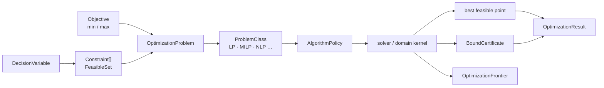
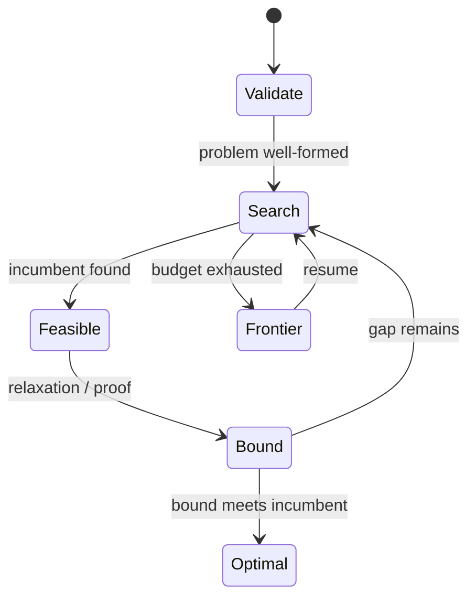

# 优化与规划

## 问题：找到可行点不等于证明最优

优化模块把变量域、约束、目标函数、可行集、界和最优性证书拆开。这样算法即使被预算截断，也能返回已知可行解和上下界，而不虚报最优。

| 对象 | 回答的问题 |
|---|---|
| `DecisionVariable` | 变量属于连续、整数还是其它 domain |
| `Constraint` | 哪些点可行，关系方向是什么 |
| `Objective` | 优化什么以及 min/max 方向 |
| `FeasibleSet` | 可行域是否闭合、为空或未知 |
| `BoundCertificate` | 当前 bound 如何得到，属于哪种 certificate |
| `OptimizationFrontier` | 尚未搜索的区域和恢复信息 |

可行性证书只能证明某点满足约束，bound certificate 只能证明界，只有二者闭合并满足 `OptimalityKind` 才能声明最优。`ProblemId` 与 `OptimizationFingerprint` 使 frontier 只能恢复到同一个问题。

跨领域上，线性代数提供矩阵运算和分解，Solve 提供约束语义，`reasoning::solver` 提供调度与 frontier 机制；本模块拥有优化问题和最优性结果。源码阅读：[variable.rs](./variable.rs) / [constraint.rs](./constraint.rs) / [objective.rs](./objective.rs) → [problem.rs](./problem.rs) → [certificate.rs](./certificate.rs) / [frontier.rs](./frontier.rs) → [result.rs](./result.rs)。测试见 [optimization tests](../../../tests/domains/optimization/)。

`optimization` 定义优化问题的身份、变量、约束、目标、可行集、结果和证书。它与 `solve` 的方程求解合同分开。

## 公开入口

- `OptimizationProblem`、`ProblemClass`、`AlgorithmPolicy`
- `DecisionVariable`、`VariableDomain`、`Integrality`
- `Constraint`、`ConstraintRelation`、`Objective` 与 `ObjectiveSense`
- `FeasibleSet`、`OptimizationResult`、`OptimizationFrontier`
- `BoundCertificate`、`CertificateKind`、`OptimalityKind`
- `OptimizationRequest`、`OptimizationLimits` 与 fingerprint

当前主要是合同和规划骨架。`execute_optimization` 通过统一请求返回可行性、目标值、bound、证书和 frontier。

## 语义

可行性不等于最优性，精确结果不等于近似结果，bound 也不等于证明。结果必须区分 `Exact`、`Conditional`、`Partial` 和资源限制。调度复用 `reasoning::solver`，不新增平行 solver crate。

## 边界与测试

数值和矩阵运算复用 `athena-numeric` 与 `linear_algebra`。测试位于 `projects/athena-engine/tests/domains/optimization/`。
