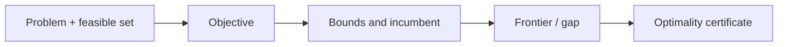
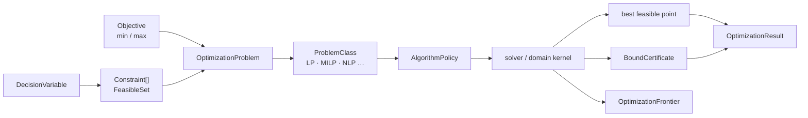
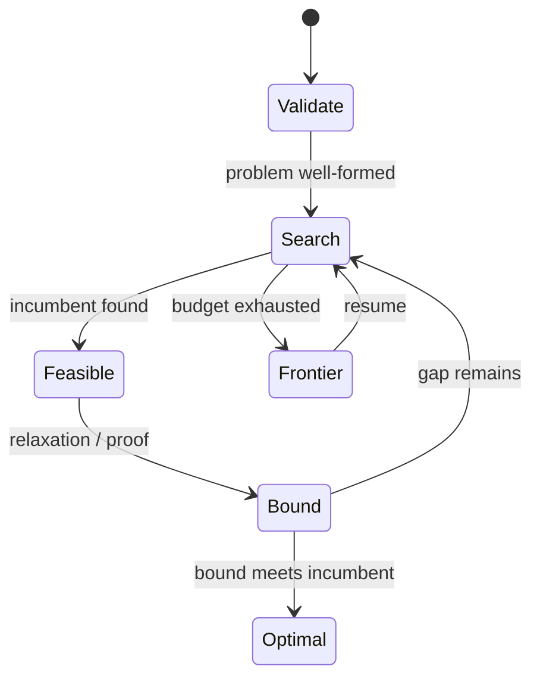

# 优化与规划

## 可行性、界与最优性

优化问题必须同时描述可行域、目标、当前最好解、上下界和是否已经证明最优。可行点不等于最优点。

## 交叉领域协作

solve 提供约束规范化，linear_algebra 提供矩阵 kernel，numeric 提供精确或机器值，reasoning::solver 提供调度和 frontier。

## 优化请求如何形成前沿

OptimizationRequest 建立 ProblemId 和 fingerprint，分类问题，选择 policy，搜索 incumbent 和 bound，生成 certificate 或 frontier，再返回 OptimizationResult。

## 问题：找到可行点不等于证明最优

优化模块把变量域、约束、目标函数、可行集、界和最优性证书拆开。这样算法即使被预算截断，也能返回已知可行解和上下界，而不虚报最优。

| 对象 | 回答的问题 |
|---|---|
| `DecisionVariable` | 变量属于连续、整数还是其它 domain |
| `Constraint` | 哪些点可行，关系方向是什么 |
| `Objective` | 优化什么以及 min/max 方向 |
| `FeasibleSet` | 可行域是否闭合、为空或未知 |
| `BoundCertificate` | 当前 bound 如何得到，属于哪种 certificate |
| `OptimizationFrontier` | 尚未搜索的区域和恢复信息 |

可行性证书只能证明某点满足约束，bound certificate 只能证明界，只有二者闭合并满足 `OptimalityKind` 才能声明最优。`ProblemId` 与 `OptimizationFingerprint` 使 frontier 只能恢复到同一个问题。

跨领域上，线性代数提供矩阵运算和分解，Solve 提供约束语义，`reasoning::solver` 提供调度与 frontier 机制；本模块拥有优化问题和最优性结果。源码阅读：[variable.rs](./variable.rs) / [constraint.rs](./constraint.rs) / [objective.rs](./objective.rs) → [problem.rs](./problem.rs) → [certificate.rs](./certificate.rs) / [frontier.rs](./frontier.rs) → [result.rs](./result.rs)。测试见 [optimization tests](../../../tests/domains/optimization/)。

`optimization` 定义优化问题的身份、变量、约束、目标、可行集、结果和证书。它与 `solve` 的方程求解合同分开。

## 公开入口

- `OptimizationProblem`、`ProblemClass`、`AlgorithmPolicy`
- `DecisionVariable`、`VariableDomain`、`Integrality`
- `Constraint`、`ConstraintRelation`、`Objective` 与 `ObjectiveSense`
- `FeasibleSet`、`OptimizationResult`、`OptimizationFrontier`
- `BoundCertificate`、`CertificateKind`、`OptimalityKind`
- `OptimizationRequest`、`OptimizationLimits` 与 fingerprint

当前主要是合同和规划骨架。`execute_optimization` 通过统一请求返回可行性、目标值、bound、证书和 frontier。

## 语义

可行性不等于最优性，精确结果不等于近似结果，bound 也不等于证明。结果必须区分 `Exact`、`Conditional`、`Partial` 和资源限制。调度复用 `reasoning::solver`，不新增平行 solver crate。

## 边界与测试

数值和矩阵运算复用 `athena-numeric` 与 `linear_algebra`。测试位于 `projects/athena-engine/tests/domains/optimization/`。

## 与源码和测试的对应

[ids.rs](./ids.rs)、[fingerprint.rs](./fingerprint.rs) 先固定问题身份，[variable.rs](./variable.rs)、[constraint.rs](./constraint.rs) 和 [objective.rs](./objective.rs) 描述问题，[feasible.rs](./feasible.rs) / [certificate.rs](./certificate.rs) 描述保证，[frontier.rs](./frontier.rs) 描述恢复。测试要区分可行、不可行、可行但无 optimality proof、bound gap、预算中断和错误 fingerprint。

## 深入理解

优化对象需要比 Solve 更多的状态。`FeasibleSet` 描述约束闭包，`Objective` 描述方向与表达式，`BoundCertificate` 描述上下界来源，`OptimizationFrontier` 描述尚未搜索的区域。四者分开后，branch-and-bound 可以在预算耗尽时返回 incumbent 和 gap，而不谎称最优。

`ProblemId` 与 fingerprint 绑定变量、约束、目标和域。恢复时如果约束顺序、provider 或数值模式改变，旧 frontier 必须拒绝。linear algebra 可以提供 relaxation 的矩阵计算，但最优性仍由本模块的 certificate 合同决定。

## 失败路径与验证

空变量、约束维度不一致、目标引用无效、整数变量被机器值替代，都应在 problem validation 阶段拒绝。搜索找到 incumbent 后仍可能没有 bound，结果只能是 feasible/partial。bound 计算失败不等于问题不可行，必须区分 unsupported、infeasible、resource limited 和 unknown。

## 维护者阅读清单

修改 `problem.rs` 要检查 fingerprint 和所有引用 ID。修改 `feasible.rs` 要检查 closure status。修改 `certificate.rs` 要检查 bound、feasibility 与 optimality 是否仍然分离。修改 frontier 时必须验证恢复使用相同问题、算法 policy、数值模式和 provider stamp。

## 为什么优化不能复用 SolveResult

Solve 关注满足约束的解集覆盖，优化还需要比较目标值、维护 incumbent、证明 bound 和判断 gap。二者都使用约束，但结果承诺不同。把优化压成 Solve 会丢失 optimality certificate，也无法表达 branch-and-bound 的 frontier。
