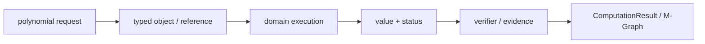
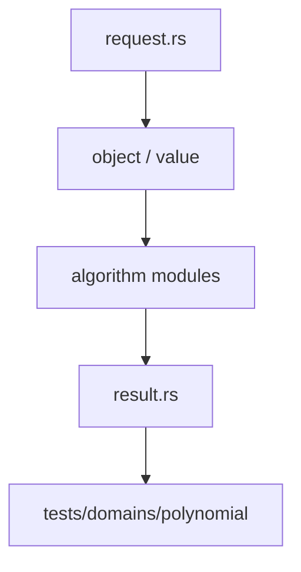

# 多项式与环

`polynomial` 是 Athena 的稀疏多项式领域，负责环身份、系数域、多项式对象、规范化和重型代数算法。长期表示使用 typed 对象和 monomial layout，不使用 `HashMap<String, Number>` 冒充数学对象。

## 能力

- `RingId`、`CoefficientDomain`、`CoefficientRingTable` 与 monomial order
- `PolynomialBuilder`、`PolynomialObject`、canonical form 与 fingerprint
- 加减乘、除法、因式分解、单变量路径和 ideal
- Buchberger、F4、modular image 与系数 kernel
- Groebner limits、frontier、证书和 JIT gate
- `PolynomialRequest`、`PolynomialResult` 与 `PolynomialDomainValue`

请求可由 `Session` 的 polynomial M-Graph 路径执行。完整结果通过 verifier replay 和 `AdmissionGate` 后才能进入 semantic graph。部分结果可以缓存并继续，但不能冒充完整 Gröbner 基。

## 边界

轻量规则变换属于 `athena-rewriter`，领域算法留在本模块。系数 parent 和域扩张复用 `algebra`/`field`。kernel artifact、临时矩阵和 JIT machine code 不进入语义 M-Graph。

## 测试

`projects/athena-engine/tests/domains/polynomial/` 覆盖 ring、表示、系数 kernel、F4、Groebner、分解、fingerprint、M-Graph admission 和 JIT parity。
## 请求与执行

`PolynomialRequest` 只携带 `PolynomialRef`、`RingId` 和显式 limits。`execute_polynomial_with_rings` 先由 `PolynomialObjectStore` 解析引用，再调用 canonical、operations、univariate、Buchberger 或 F4 实现。没有 ring table 和对象仓时，`execute_polynomial` 明确返回 `UnsupportedOperation`。

典型路径：`PolynomialBuilder` → `PolynomialObjectStore` → `PolynomialRequest` → `execute_polynomial_with_rings` → `PolynomialResult` → verifier → `AdmissionGate`。`GroebnerFrontier` 保存候选基、pending pairs、插入队列和证书计数，可由 resume API 继续。

## 文件地图

`ring.rs`/`ring_table.rs` 定义环和系数域，`object.rs`/`object_ref.rs` 定义对象身份，`repr.rs`/`monomial_layout.rs` 定义表示，`operations.rs` 与 `univariate.rs` 提供基础算法，`groebner.rs`/`f4.rs` 提供 Gröbner 路径，`modular_image.rs` 提供模像与 CRT 重构，`mgraph.rs` 负责缓存和准入。

## 证据与失败

引用失效、环不匹配、除零、预算耗尽和重构验证失败都返回结构化 `Diagnostic`。`complete=false` 的证书只能产生部分结果，不能写入 semantic M-Graph。

## 架构图

## 合同表

| 阶段 | 输入 | 输出 | 必须保留 |
|---|---|---|---|
| 构造 | domain object、parent、scope | typed reference | identity、revision |
| 计划 | request、limits、capability | domain plan | algorithm、budget |
| 执行 | canonical representation | value、candidate 或 frontier | provenance、diagnostic |
| 验证 | value、certificate、dependencies | accepted claim 或 reject | replay evidence |
| 发布 | verified result | structured result | status、coverage、conditions |

## 源码阅读顺序

先读 `request.rs`，确认输入的身份和资源字段。再读对象/值模块，确认 payload、parent 和生命周期。随后读算法实现，最后读 `result.rs` 与测试，核对成功、失败和资源受限分支。重点顺序是 ring → object_ref → operations → groebner/f4 → modular_image → mgraph。

## 结果与证据

| 情况 | 结果状态 | 可以做什么 |
|---|---|---|
| 独立验证通过 | `Exact` 或 `Verified` | 按证书保证继续组合 |
| 依赖假设或分支 | `Conditional` | 携带条件继续查询 |
| 只得到候选 | `Candidate` | 等待 verifier，不得准入 |
| 算法被预算截断 | `Partial` / `ResourceLimited` | 保存 frontier 后恢复 |
| 输入或能力不满足 | `Invalid` / `Unknown` | 读取结构化诊断 |

证据不是日志字段。它必须能说明输入对象、算法前置条件、依赖关系和重放方式。缓存只能复用计算产物，不能代替验证和准入。

## 测试矩阵

| 测试层 | 必须证明 |
|---|---|
| 对象与规范化 | identity、parent、canonical form |
| 算法 | 正常值、边界值、域不匹配、除零或无解 |
| 结果 | payload、status、coverage、diagnostic |
| 资源 | budget、取消、frontier、resume |
| 证据 | replay、冲突、candidate 与 admission |

## 明确边界

本模块不解析源文本，不负责 UI、render、N-API 或平台对象。跨领域调用必须使用显式 capability、embedding 或 TypedView，并保留来源 fingerprint 与 revision。新增算法必须同步新增结果状态、失败路径和测试，不得只增加一个函数名。
