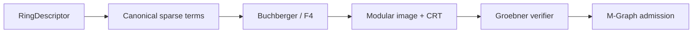
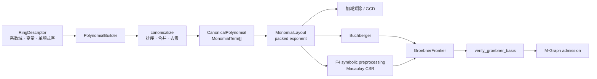
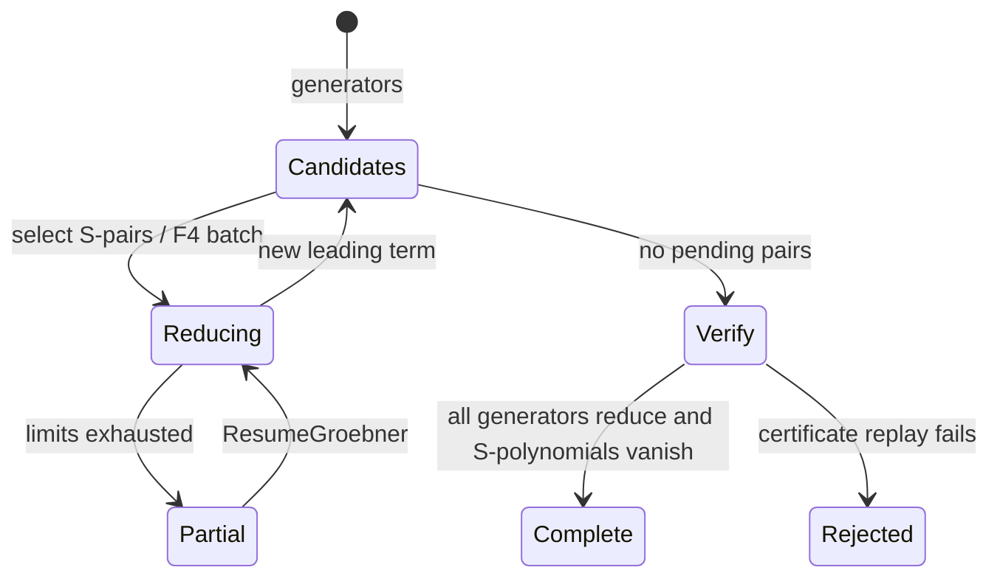

# 多项式与环

## 理想、约化与 Gröbner 计算

多项式算法依赖环、系数域、变量序和单项式序。模块解决规范化、约化、因式分解、理想消元和 Gröbner 证书的完整链路。

## 交叉领域协作

field 提供系数域，linear_algebra 执行 F4 的 Macaulay 消元，number_theory 提供模像/CRT/Wang 重构，solve 消费消元后的解集关系。

## 多项式请求如何进入消元内核

PolynomialRef 先在 object store 解析并校验 RingId，再 canonicalize，按请求选择基础运算、Buchberger、F4 或 modular path，形成 frontier/certificate，最后经 verifier 和 AdmissionGate。

## 数学表示如何驱动算法

| 表示层 | 核心类型 | 不变量 | 直接影响的算法 |
|---|---|---|---|
| 环身份 | `RingDescriptor`、`RingFingerprint` | 系数域、变量序、单项式序共同决定身份 | 所有运算 |
| 稀疏项 | `MonomialTerm` | 系数非零、指数长度等于变量数 | canonical、加乘、约化 |
| 单项式布局 | `MonomialLayout`、`PackedMonomial` | exponent 宽度与 order 已编译 | F4、leading term、divides、LCM |
| 物理表示 | `PolynomialRepr` | dense/sparse 转换保持数学相等 | kernel 选择 |
| 对象引用 | `PolynomialRef` | 指向 `PolynomialObjectStore`，不携带 owning payload | request、cache、M-Graph |

## 请求和算法分流

| `PolynomialRequest` | 路径 | 中间资产 | 终态 |
|---|---|---|---|
| `Normalize` | canonicalize | 排序后的稀疏项 | `PolynomialValue` |
| `Div` / `Gcd` | 单变量 Euclidean | quotient、remainder | `UnivariateDivisionValue` / polynomial |
| `Factor` | 单变量因式分解 | factors、cofactor、limits | 完整或部分分解 |
| `Groebner` | Buchberger | critical pairs、reduced basis | verified basis 或 frontier |
| `GroebnerF4` | sugar 选择、symbolic preprocessing、Macaulay 消元 | CSR matrix、basis update | verified basis 或 frontier |
| `ModularImage` | 映射到 `F_p` 环 | `ModularImage` | 模像 |
| `CrtCombineModular` | CRT + Wang reconstruction | residue polynomial | 重构并 replay 的结果 |

`GroebnerFrontier` 保存候选基、待处理 critical pairs、待插入多项式、sugar 和累计步数。它是可恢复算法状态，不是已经证明的 Gröbner 基。`GroebnerCertificate.complete` 与 verification 必须同时满足，结果才具备 exact witness。

## 代码阅读路径

[ring.rs](./ring.rs) / [ring_table.rs](./ring_table.rs) → [object.rs](./object.rs) / [object_ref.rs](./object_ref.rs) → [monomial_layout.rs](./monomial_layout.rs) / [repr.rs](./repr.rs) → [operations.rs](./operations.rs) / [univariate.rs](./univariate.rs) → [groebner.rs](./groebner.rs) / [f4.rs](./f4.rs) → [modular_image.rs](./modular_image.rs) → [certificate.rs](./certificate.rs) / [mgraph.rs](./mgraph.rs)。

测试对应 [polynomial tests](../../../tests/domains/polynomial/)：[ring_contract.rs](../../../tests/domains/polynomial/ring_contract.rs) 验证环身份，[repr.rs](../../../tests/domains/polynomial/repr.rs) 与 [monomial_layout.rs](../../../tests/domains/polynomial/monomial_layout.rs) 验证表示，[f4.rs](../../../tests/domains/polynomial/f4.rs) / [groebner.rs](../../../tests/domains/polynomial/groebner.rs) 验证算法，[mgraph.rs](../../../tests/domains/polynomial/mgraph.rs) 验证 complete、partial、placeholder 和 admission。

`polynomial` 是 Athena 的稀疏多项式领域，负责环身份、系数域、多项式对象、规范化和重型代数算法。长期表示使用 typed 对象和 monomial layout，不使用 `HashMap<String, Number>` 冒充数学对象。

## 能力

- `RingId`、`CoefficientDomain`、`CoefficientRingTable` 与 monomial order
- `PolynomialBuilder`、`PolynomialObject`、canonical form 与 fingerprint
- 加减乘、除法、因式分解、单变量路径和 ideal
- Buchberger、F4、modular image 与系数 kernel
- Groebner limits、frontier、证书和 JIT gate
- `PolynomialRequest`、`PolynomialResult` 与 `PolynomialDomainValue`

请求可由 `Session` 的 polynomial M-Graph 路径执行。完整结果通过 verifier replay 和 `AdmissionGate` 后才能进入 semantic graph。部分结果可以缓存并继续，但不能冒充完整 Gröbner 基。

## 边界

轻量规则变换属于 `athena-rewriter`，领域算法留在本模块。系数 parent 和域扩张复用 `algebra`/`field`。kernel artifact、临时矩阵和 JIT machine code 不进入语义 M-Graph。

## 测试

`projects/athena-engine/tests/domains/polynomial/` 覆盖 ring、表示、系数 kernel、F4、Groebner、分解、fingerprint、M-Graph admission 和 JIT parity。
## 请求与执行

`PolynomialRequest` 只携带 `PolynomialRef`、`RingId` 和显式 limits。`execute_polynomial_with_rings` 先由 `PolynomialObjectStore` 解析引用，再调用 canonical、operations、univariate、Buchberger 或 F4 实现。没有 ring table 和对象仓时，`execute_polynomial` 明确返回 `UnsupportedOperation`。

典型路径：`PolynomialBuilder` → `PolynomialObjectStore` → `PolynomialRequest` → `execute_polynomial_with_rings` → `PolynomialResult` → verifier → `AdmissionGate`。`GroebnerFrontier` 保存候选基、pending pairs、插入队列和证书计数，可由 resume API 继续。

## 文件地图

`ring.rs`/`ring_table.rs` 定义环和系数域，`object.rs`/`object_ref.rs` 定义对象身份，`repr.rs`/`monomial_layout.rs` 定义表示，`operations.rs` 与 `univariate.rs` 提供基础算法，`groebner.rs`/`f4.rs` 提供 Gröbner 路径，`modular_image.rs` 提供模像与 CRT 重构，`mgraph.rs` 负责缓存和准入。

## 证据与失败

引用失效、环不匹配、除零、预算耗尽和重构验证失败都返回结构化 `Diagnostic`。`complete=false` 的证书只能产生部分结果，不能写入 semantic M-Graph。
