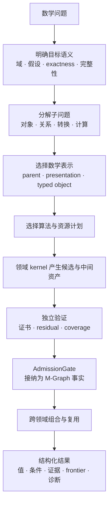
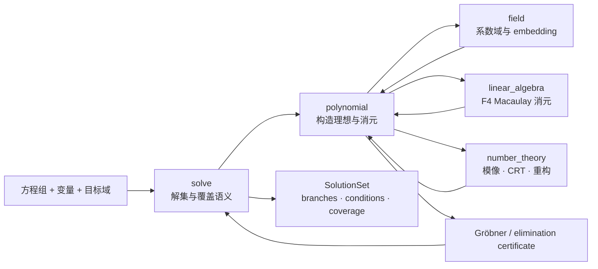
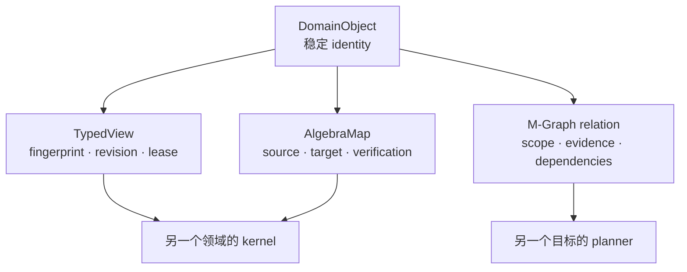

# Athena 数学领域

这一层解决的不是“如何给函数分类”，而是：**一个数学问题进入 Athena 后，怎样被拆成可表示、可计算、可验证、可复用的子问题。**

## 从什么问题开始

调用方通常不是来寻找某个 Rust 模块，而是提出以下一类问题：

| 用户问题 | Athena 需要回答的数学问题 | 首要领域 | 必然协作的领域 |
|---|---|---|---|
| 解一组多项式方程 | 解集是什么，是否完整，在什么域上成立 | [方程求解](./solve/readme.md) | [多项式](./polynomial/readme.md)、[域](./field/readme.md)、[线性代数](./linear_algebra/readme.md) |
| 计算 Gröbner 基 | 环、单项式序和生成理想是什么，结果是否通过 Buchberger 判据 | [多项式](./polynomial/readme.md) | [代数地基](./algebra/readme.md)、[数论](./number_theory/readme.md)、[线性代数](./linear_algebra/readme.md) |
| 分解一个大整数 | 哪些因子已被确认，剩余 cofactor 是什么，能否继续 | [数论](./number_theory/readme.md) | 数值内核、M-Graph verifier |
| 求积分、极限或级数 | 结果依赖哪些假设，余项和收敛域是什么 | [微积分](./calculus/readme.md) | [方程求解](./solve/readme.md)、[多项式](./polynomial/readme.md) |
| 求矩阵秩或解线性系统 | 元素域是什么，要求 exact 还是 machine，解空间是否完整 | [线性代数](./linear_algebra/readme.md) | [域](./field/readme.md)、[跨领域视图](./views/readme.md) |
| 计算有限域扩张的伽罗瓦群 | 扩张如何表示，是否正规可分，自同构从哪里来 | [伽罗瓦理论](./galois/readme.md) | [域](./field/readme.md)、[群](./group/readme.md)、[代数地基](./algebra/readme.md) |
| 求图的路径、连通性或生成树 | 图的 revision 和权重域是什么，结论有何证书 | [图论](./graph_theory/readme.md) | [跨领域视图](./views/readme.md)、[线性代数](./linear_algebra/readme.md) |
| 求一个优化问题的最优解 | 可行性、目标 bound 与最优性证明分别是什么 | [优化](./optimization/readme.md) | [方程求解](./solve/readme.md)、[线性代数](./linear_algebra/readme.md) |

## 宏观处理路线

每一步解决不同的问题。表示决定算法可以安全假设什么，算法决定产生哪些候选，验证决定候选能否成为事实，M-Graph 决定这些事实如何被另一个领域继续使用。

## 问题如何分解

以“解多项式方程组”为例：

这里没有一个领域单独拥有完整答案：`solve` 拥有“解集是否完整”的语义，`polynomial` 拥有理想和消元算法，`field` 保证系数运算合法，`linear_algebra` 执行矩阵化消元，`number_theory` 支持模算法和有理重构。

## 为什么需要 typed 表示

| 如果只用通用表达式树 | 会丢失什么 | Athena 使用的表示 |
|---|---|---|
| `Plus[x, y]` 式字符串 head | 系数域、canonical form、精确性 | `TermStore` + closed semantic operator |
| `Vec<Vec<Number>>` 矩阵 | parent、shape、layout、exact/machine 边界 | `MatrixRef` + `MatrixParent` + `Layout` |
| `HashMap<String, Number>` 多项式 | 变量序、单项式序、环身份 | `Polynomial` + `RingId` + `MonomialLayout` |
| 裸整数列表表示因式分解 | 剩余 cofactor、素性证据、完整性 | `Factorization` + `FactorFrontier` |
| 一个 `TermId` 表示积分结果 | 条件、分支、余项、收敛域 | `CalculusResult` + typed payload |
| 一个布尔值表示“求解成功” | 解集覆盖、局部性、可恢复状态 | `SolutionSet` + `CoverageStatus` |

typed 表示让算法不必反复猜测输入语义，也让 verifier 能重放精确的数学主张。

## 跨领域协作机制

跨领域协作有三种形式：

| 机制 | 适用情况 | 示例 |
|---|---|---|
| 共享 parent / embedding | 两个领域操作同一个代数对象 | `Q` 到 `F_p` 的显式映射 |
| `TypedView` | 另一个领域只需只读投影 | 图的邻接矩阵视图、多项式的 Macaulay 行视图 |
| M-Graph relation | 需要复用已经验证的数学事实 | “该 basis 是这个 ideal 的 Gröbner 基” |

物理 payload 不会因为跨领域使用而复制成第二个数学身份。view 负责只读访问，map 负责语义转换，relation 负责已验证事实。

## 推荐阅读顺序

1. 先读与你的问题直接对应的领域 README，理解它如何定义“完成”。
2. 再读该 README 的表示章节，弄清算法依赖的 parent、对象身份和 canonical form。
3. 顺着算法图进入源码文件，观察候选、frontier 和证书怎样产生。
4. 阅读跨领域章节，理解输入来自哪里、结果流向哪里。
5. 最后阅读 request/result API 与测试，核对真实可用范围和失败行为。

若要理解整个体系，建议依次阅读：[代数地基](./algebra/readme.md) → [域](./field/readme.md) / [群](./group/readme.md) → [多项式](./polynomial/readme.md) / [线性代数](./linear_algebra/readme.md) / [数论](./number_theory/readme.md) → [Solve](./solve/readme.md) / [微积分](./calculus/readme.md) / [优化](./optimization/readme.md) → [TypedView](./views/readme.md) 与 M-Graph。
