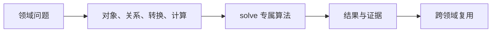
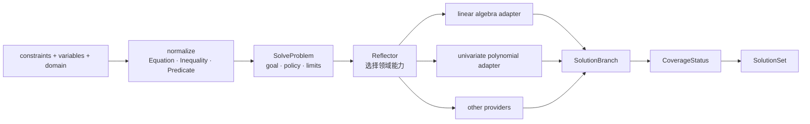
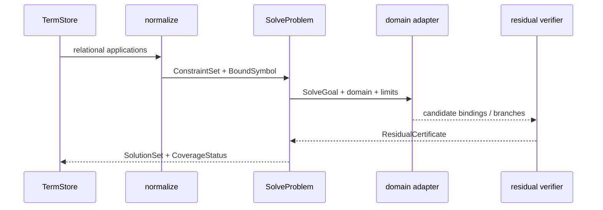

# 方程求解

## 模块解决的问题

求解模块要表达解集而不是单个成功值：唯一解、参数族、认证子集、局部根和实例都必须可区分。

## 交叉问题

linear_algebra 提供 exact/machine disposition，polynomial 提供根和因式分解，number_theory 提供重构，M-Graph 提供可复用关系。

## 处理流

把 TermStore 中的关系规范化为 ConstraintSet，建立 SolveProblem，Reflector 选择 adapter，生成 SolutionBranch，验证 residual，按 CoverageStatus 发布 SolutionSet。

## 问题：什么才算“解完了”

求解并不等于找到一个代入后成立的值。Athena 必须区分完整解集、经过证明的子集、局部数值根、一个实例以及仍可继续的搜索。

| 目标 | 结果语义 | 不能冒充 |
|---|---|---|
| 精确解集 | 所有 branch + full coverage | 一个可行实例 |
| 数值根 | 局部收敛、误差和初值信息 | 全局解集 |
| `FindInstance` 类目标 | 一个满足约束的 binding | 完备枚举 |
| 参数解 | binding + conditions + free variables | 单个向量 |
| 资源截断 | certified subset + `ResumeToken` | `Unknown` 或完整失败 |

## 从约束到领域算法

`normalize_relational_application` 将中性 IR 变成 `Equation`、`Inequality`、逻辑连接和量词。`BoundSymbol` 与 `BindingId` 防止自由变量和局部绑定混淆。线性 adapter 消费 `ExactSolveResult` 或 machine witness，多项式 adapter 消费带完整性信息的因式分解。

## 跨领域责任

| 领域 | 向 Solve 提供什么 | Solve 额外负责什么 |
|---|---|---|
| 线性代数 | 唯一解、无解、欠定 disposition | 转成 branch、free variable 和 coverage |
| 多项式 | 因子、根候选、分解完整性 | multiplicity、遗漏风险、solution branches |
| 数值算法 | 局部近似根与误差 | 标记 local/approximate，不提升为 exact |
| M-Graph | 已知关系与 proof ref | 复用事实并记录 residual certificate |

源码阅读：[constraint.rs](./constraint.rs) → [normalize.rs](./normalize.rs) → [problem.rs](./problem.rs) / [goal.rs](./goal.rs) → [adapters_linear.rs](./adapters_linear.rs) / [adapters_univariate.rs](./adapters_univariate.rs) → [solution.rs](./solution.rs) / [coverage.rs](./coverage.rs)。测试见 [Solve tests](../../../tests/domains/solve/)。

`solve` 定义跨领域求解的数学合同：约束、问题、目标、解集、覆盖度、条件和可恢复 frontier。调度协议位于 `reasoning::solver`，两者保持分离。

## 公开入口

- `Constraint`、`SolveProblem`、`SolveGoal` 与 `SolutionSet`
- `BindingMap`、`BoundSymbol`、`ResidualCertificate`
- `CoverageStatus`、`SolveDomain`、`ResumeToken`
- 线性系统和单变量多项式的 adapter
- `normalize_constraint_conjunction`、`require_goal` 与 `execute_linear_system_goal`

结果必须说明解集覆盖范围、残差、条件和完备性。找到一个实例不等于找到完整解集，局部数值根也不等于全局解。

## 执行路径

`SolveGoal` 由 engine 的 Reflector 选择领域 capability，再调用线性代数或多项式 adapter。`Frontier` 和 `ResumeToken` 保存资源截断后的继续入口，证书通过统一 verifier 与 M-Graph admission。

## 边界与测试

本模块不解析源语言，不定义 `SolverRequest`，也不创建 `athena-solver` crate。合同测试位于 `projects/athena-engine/tests/domains/solve/`。

## 深入理解

`ConstraintSet` 保留 And/Or 结构，`BoundSymbol` 区分自由变量和局部绑定，`SolutionBranch` 保存一组 binding 与 branch status。线性系统的欠定结果会转换成带自由变量的 branch，多项式根会转换成带 multiplicity 和条件的 branch。这样 Solve 不需要猜测下游算法的返回格式。

`CoverageStatus` 是求解结果的核心：Full、CertifiedSubset、LocalOnly、Unknown 等状态决定关系能否进入 exact rewrite。`ResidualCertificate` 记录未消除的约束，`ResumeToken` 绑定 provider stamp。任何 adapter 都必须把自己的算法状态映射到这套覆盖语义。

## 失败路径与验证

约束规范化可能遇到非法关系、未绑定符号、空析取或域不匹配。adapter 返回的 branch 必须经过 residual replay，不能仅因为 provider 返回 success 就把 branch 标为 exact。`CoverageStatus` 还要反映遗漏风险：已找到的根、已证明的子集和完整解集是不同状态。

## 维护者阅读清单

修改 `constraint.rs` 或 `normalize.rs` 要检查自由变量、量词和 And/Or 结构。修改 adapter 要检查它如何映射下游的 exact、machine、partial 和 resource limited。修改 `solution.rs` 要检查 branch status、multiplicity、conditions 和 `ResumeToken`。新增 SolveGoal 必须先规定 coverage 和 completeness，不能只加一个枚举值。
