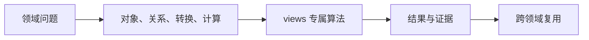
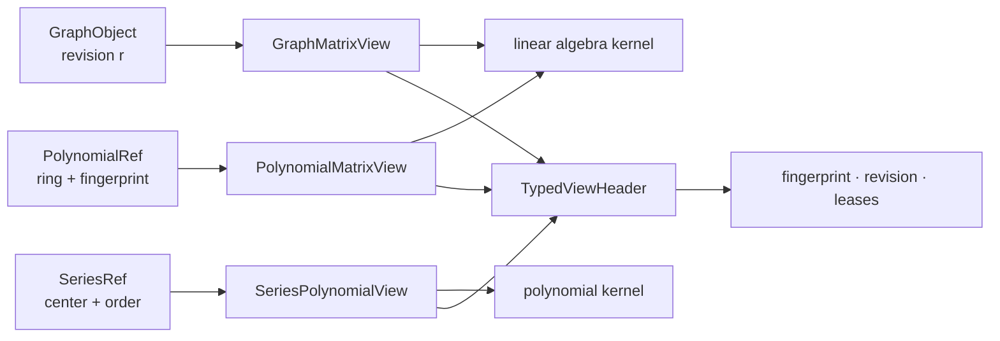

# 跨领域 TypedView

## 模块解决的问题

跨领域算法需要读取对象，却不能复制成第二个数学身份。TypedView 解决的是只读投影、来源追踪和 revision 失效问题。

## 交叉问题

GraphMatrixView 给线代提供图矩阵，PolynomialMatrixView 给 F4 提供项结构，SeriesPolynomialView 给多项式提供有限前缀。源领域仍然拥有对象。

## 处理流

从 source object 打开 view，写入 fingerprint、revision 和 lease，目标 kernel 在视图有效期内读取，结果发布时由目标领域重新 intern。

## 问题：另一个领域怎样读取对象而不复制语义

多项式算法需要矩阵消元，图算法可能需要邻接矩阵，级数前缀可以被多项式 kernel 消费。直接复制成 `Vec` 会丢失来源、revision 和生命周期，因此使用只读 `TypedView`。

| View | 暴露的数据 | 保留的语义 | 典型消费者 |
|---|---|---|---|
| `GraphMatrixView` | nodes、edges、nnz | graph identity 与 revision | 稀疏线性代数 |
| `PolynomialMatrixView` | monomial terms、ring | polynomial fingerprint | Macaulay/系数矩阵 |
| `SeriesPolynomialView` | `(coefficient, exponent)` | series source 与截断阶 | 多项式运算 |

`TypedViewHeader` 记录 `ViewKind`、`ViewFingerprint`、`ViewRevision` 和 `LeaseSet`。源对象变化后，旧 revision 不能继续用于缓存或验证。lease 非空时，消费者必须在视图有效期内保持运行时资源。

View 不拥有 payload，也不创建新的数学对象。需要语义转换时使用 embedding/map，需要持久化新对象时由目标领域重新 intern。源码见 [graph_matrix.rs](./graph_matrix.rs)、[polynomial_matrix.rs](./polynomial_matrix.rs)、[series_polynomial.rs](./series_polynomial.rs)。

`views` 提供只读、带身份信息的跨领域视图，让一个领域访问另一个领域的对象时保留 fingerprint、revision 和租约语义。

## 公开入口

- `ViewFingerprint`、`ViewRevision`、`ViewKind`、`LeaseSet`
- `GraphMatrixView`：图对象到矩阵视图
- `PolynomialMatrixView`：多项式系数到矩阵视图
- `SeriesPolynomialView`：级数前缀到多项式风格投影

View 不拥有 `DomainObject` payload，也不创建第二份长期对象身份。源对象发生结构变化时 revision 必须变化，跨域使用方应检查 capability 和生命周期约束。

## 边界

TypedView 不能通过 `Vec` 全量复制或裸 `TermId` 冒充跨域对象。物理存储、chunk 驻留、GC root 和算法预算由源对象及 runtime 管理。View 只是受约束的读取和转换入口，不是新的数学领域。

## 使用场景

线性代数可以消费图或多项式的矩阵视图，级数可以暴露有限前缀供多项式 kernel 使用。任何转换都应保留来源 fingerprint、revision 和适用状态。

## 与源码和测试的对应

[mod.rs](./mod.rs) 定义 header、kind、fingerprint、revision 和 lease，[graph_matrix.rs](./graph_matrix.rs)、[polynomial_matrix.rs](./polynomial_matrix.rs)、[series_polynomial.rs](./series_polynomial.rs) 分别实现三种投影。测试应覆盖 view 只读性、source revision 改变、lease 失效、fingerprint mismatch、目标 kernel 消费和目标对象重新 intern。

## 深入理解

View 的 header 是语义防火墙。`ViewKind` 说明投影类型，`ViewFingerprint` 说明源内容，`ViewRevision` 说明源对象版本，`LeaseSet` 说明底层资源仍然有效。目标 kernel 只读取 view 暴露的切片，不获得修改源对象的权限。

GraphMatrixView 不把图变成新的 MatrixId，PolynomialMatrixView 不把多项式重建成第二个 Polynomial，SeriesPolynomialView 只暴露有限阶前缀。因此线性代数和多项式可以共享计算，却不会共享错误的对象身份。需要持久化时，目标领域必须重新构造自己的对象并生成新 fingerprint。

## 失败路径与验证

打开 view 时要检查 source object 是否仍存在、revision 是否匹配、lease 是否有效。图的边列表、矩阵的项列表和级数的截断项都可能在源对象变更后失效。view 不应缓存一个没有 revision 的裸切片，也不能把源对象的 fingerprint 改写成目标对象 fingerprint。

## 维护者阅读清单

修改任一 view 时要检查 `TypedViewHeader`、`ViewKind`、fingerprint、revision 和 lease。新增 view 必须声明 source owner、只读字段、目标 kernel 和失效条件。跨领域测试应验证零拷贝访问、源对象修改后的拒绝、不同 parent 的拒绝和目标对象重新 intern。

## 为什么 view 不应成为新对象

如果每次跨域读取都生成一个新的 MatrixId 或 PolynomialId，缓存会无法判断源对象是否改变，证书也无法指出实际使用的来源。TypedView 只保存受限访问和来源元数据，目标领域需要长期保存时再显式构造新对象，这一步会生成新的 identity 和 proof boundary。

这组测试保证 view 是临时访问协议，而不是隐藏的共享可变对象。目标算法完成后，如果结果需要长期存在，必须显式创建目标领域对象；该对象拥有自己的 parent、fingerprint 和生命周期，源 view 的 lease 结束不会破坏它。

这套协议让跨领域优化有清晰边界：可以用零拷贝 view 降低转换成本，但不能因此跳过目标领域的验证。Macaulay 矩阵仍由线代 kernel 验证，图矩阵仍受 GraphRevision 约束，级数前缀仍受 order 和 remainder 约束。

因此 view 的收益只在数据访问层，数学责任仍留在消费它的领域。视图关闭后，源对象仍由原 owner 管理，目标结果也不会悬挂在临时借用上。

这条边界同时约束性能优化和语义安全。

任何 zero-copy 改动都必须先证明 view 的生命周期和 revision 检查没有被绕过。

这也是 view 文档必须和源对象及目标 kernel 一起阅读的原因。

阅读任一 view 时，应先确认 source owner，再确认暴露字段和目标算法，最后检查 header 的 fingerprint、revision 和 lease。只有这样才能判断一次零拷贝访问是否仍然对应同一个数学对象。
