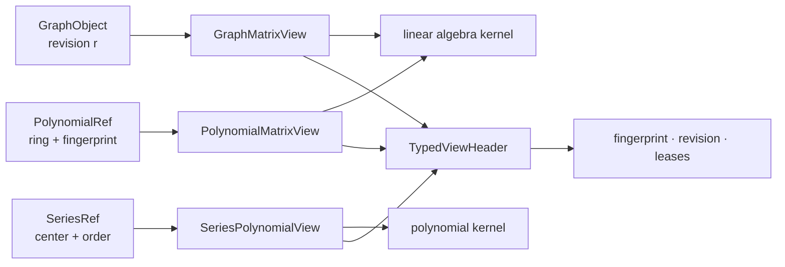

# 跨领域 TypedView

## 问题：另一个领域怎样读取对象而不复制语义

多项式算法需要矩阵消元，图算法可能需要邻接矩阵，级数前缀可以被多项式 kernel 消费。直接复制成 `Vec` 会丢失来源、revision 和生命周期，因此使用只读 `TypedView`。

| View | 暴露的数据 | 保留的语义 | 典型消费者 |
|---|---|---|---|
| `GraphMatrixView` | nodes、edges、nnz | graph identity 与 revision | 稀疏线性代数 |
| `PolynomialMatrixView` | monomial terms、ring | polynomial fingerprint | Macaulay/系数矩阵 |
| `SeriesPolynomialView` | `(coefficient, exponent)` | series source 与截断阶 | 多项式运算 |

`TypedViewHeader` 记录 `ViewKind`、`ViewFingerprint`、`ViewRevision` 和 `LeaseSet`。源对象变化后，旧 revision 不能继续用于缓存或验证。lease 非空时，消费者必须在视图有效期内保持运行时资源。

View 不拥有 payload，也不创建新的数学对象。需要语义转换时使用 embedding/map，需要持久化新对象时由目标领域重新 intern。源码见 [graph_matrix.rs](./graph_matrix.rs)、[polynomial_matrix.rs](./polynomial_matrix.rs)、[series_polynomial.rs](./series_polynomial.rs)。

`views` 提供只读、带身份信息的跨领域视图，让一个领域访问另一个领域的对象时保留 fingerprint、revision 和租约语义。

## 公开入口

- `ViewFingerprint`、`ViewRevision`、`ViewKind`、`LeaseSet`
- `GraphMatrixView`：图对象到矩阵视图
- `PolynomialMatrixView`：多项式系数到矩阵视图
- `SeriesPolynomialView`：级数前缀到多项式风格投影

View 不拥有 `DomainObject` payload，也不创建第二份长期对象身份。源对象发生结构变化时 revision 必须变化，跨域使用方应检查 capability 和生命周期约束。

## 边界

TypedView 不能通过 `Vec` 全量复制或裸 `TermId` 冒充跨域对象。物理存储、chunk 驻留、GC root 和算法预算由源对象及 runtime 管理。View 只是受约束的读取和转换入口，不是新的数学领域。

## 使用场景

线性代数可以消费图或多项式的矩阵视图，级数可以暴露有限前缀供多项式 kernel 使用。任何转换都应保留来源 fingerprint、revision 和适用状态。
