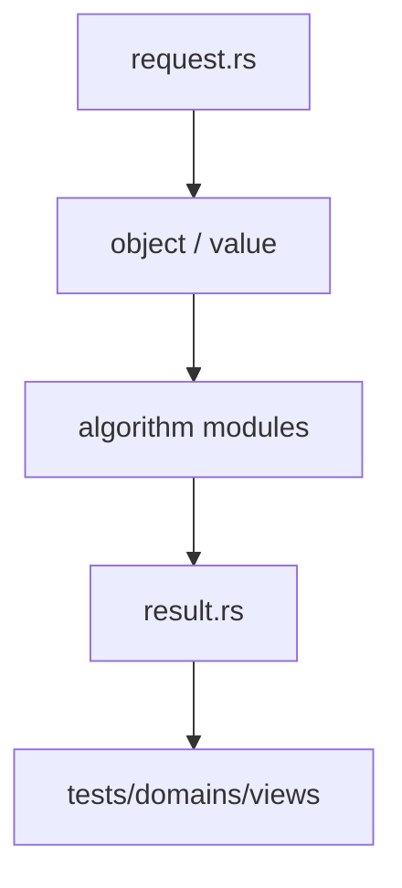

# 跨领域 TypedView

`views` 提供只读、带身份信息的跨领域视图，让一个领域访问另一个领域的对象时保留 fingerprint、revision 和租约语义。

## 公开入口

- `ViewFingerprint`、`ViewRevision`、`ViewKind`、`LeaseSet`
- `GraphMatrixView`：图对象到矩阵视图
- `PolynomialMatrixView`：多项式系数到矩阵视图
- `SeriesPolynomialView`：级数前缀到多项式风格投影

View 不拥有 `DomainObject` payload，也不创建第二份长期对象身份。源对象发生结构变化时 revision 必须变化，跨域使用方应检查 capability 和生命周期约束。

## 边界

TypedView 不能通过 `Vec` 全量复制或裸 `TermId` 冒充跨域对象。物理存储、chunk 驻留、GC root 和算法预算由源对象及 runtime 管理。View 只是受约束的读取和转换入口，不是新的数学领域。

## 使用场景

线性代数可以消费图或多项式的矩阵视图，级数可以暴露有限前缀供多项式 kernel 使用。任何转换都应保留来源 fingerprint、revision 和适用状态。

## 架构图

## 合同表

| 阶段 | 输入 | 输出 | 必须保留 |
|---|---|---|---|
| 构造 | domain object、parent、scope | typed reference | identity、revision |
| 计划 | request、limits、capability | domain plan | algorithm、budget |
| 执行 | canonical representation | value、candidate 或 frontier | provenance、diagnostic |
| 验证 | value、certificate、dependencies | accepted claim 或 reject | replay evidence |
| 发布 | verified result | structured result | status、coverage、conditions |

## 源码阅读顺序

先读 `request.rs`，确认输入的身份和资源字段。再读对象/值模块，确认 payload、parent 和生命周期。随后读算法实现，最后读 `result.rs` 与测试，核对成功、失败和资源受限分支。

## 结果与证据

| 情况 | 结果状态 | 可以做什么 |
|---|---|---|
| 独立验证通过 | `Exact` 或 `Verified` | 按证书保证继续组合 |
| 依赖假设或分支 | `Conditional` | 携带条件继续查询 |
| 只得到候选 | `Candidate` | 等待 verifier，不得准入 |
| 算法被预算截断 | `Partial` / `ResourceLimited` | 保存 frontier 后恢复 |
| 输入或能力不满足 | `Invalid` / `Unknown` | 读取结构化诊断 |

证据不是日志字段。它必须能说明输入对象、算法前置条件、依赖关系和重放方式。缓存只能复用计算产物，不能代替验证和准入。

## 测试矩阵

| 测试层 | 必须证明 |
|---|---|
| 对象与规范化 | identity、parent、canonical form |
| 算法 | 正常值、边界值、域不匹配、除零或无解 |
| 结果 | payload、status、coverage、diagnostic |
| 资源 | budget、取消、frontier、resume |
| 证据 | replay、冲突、candidate 与 admission |

## 明确边界

本模块不解析源文本，不负责 UI、render、N-API 或平台对象。跨领域调用必须使用显式 capability、embedding 或 TypedView，并保留来源 fingerprint 与 revision。新增算法必须同步新增结果状态、失败路径和测试，不得只增加一个函数名。
