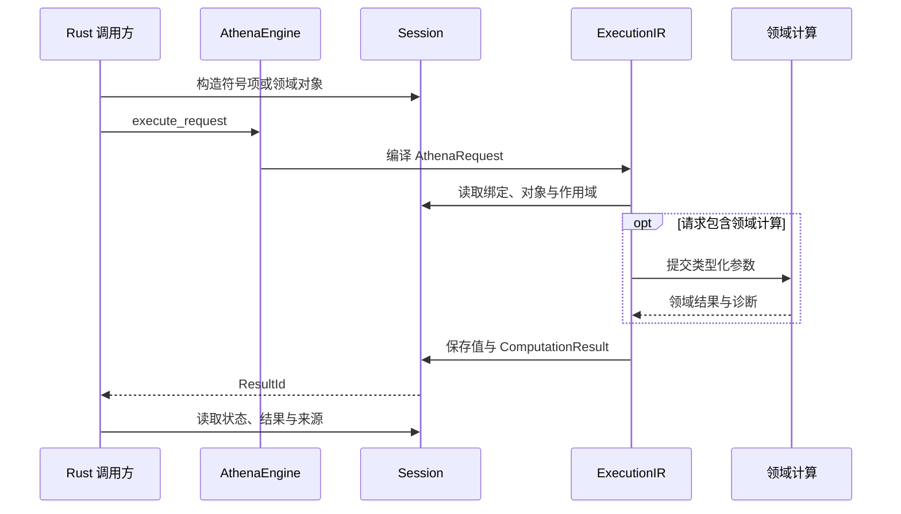
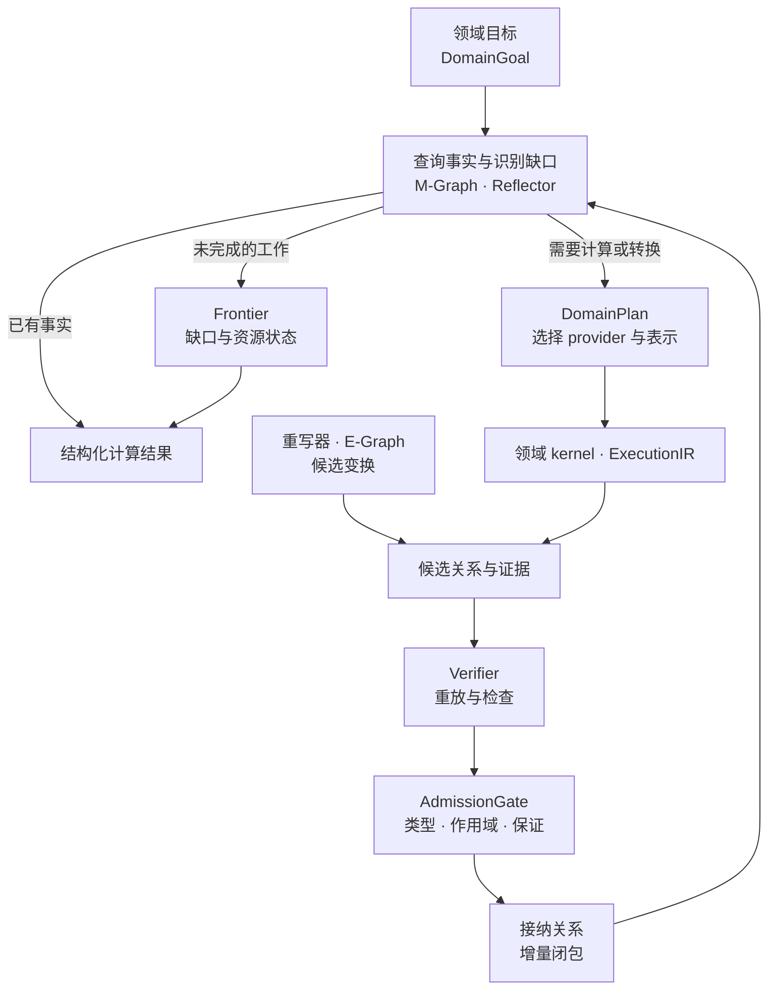
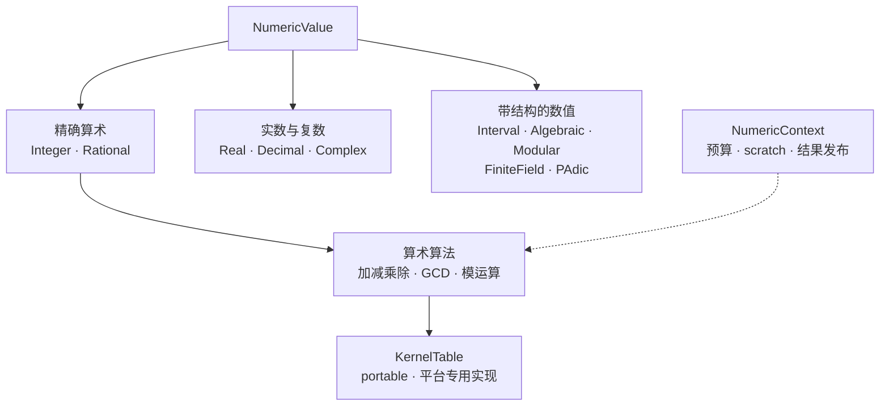
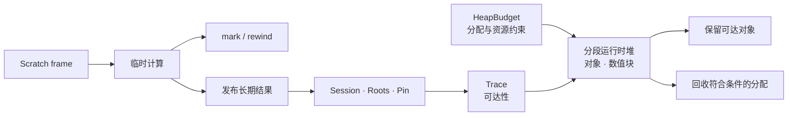
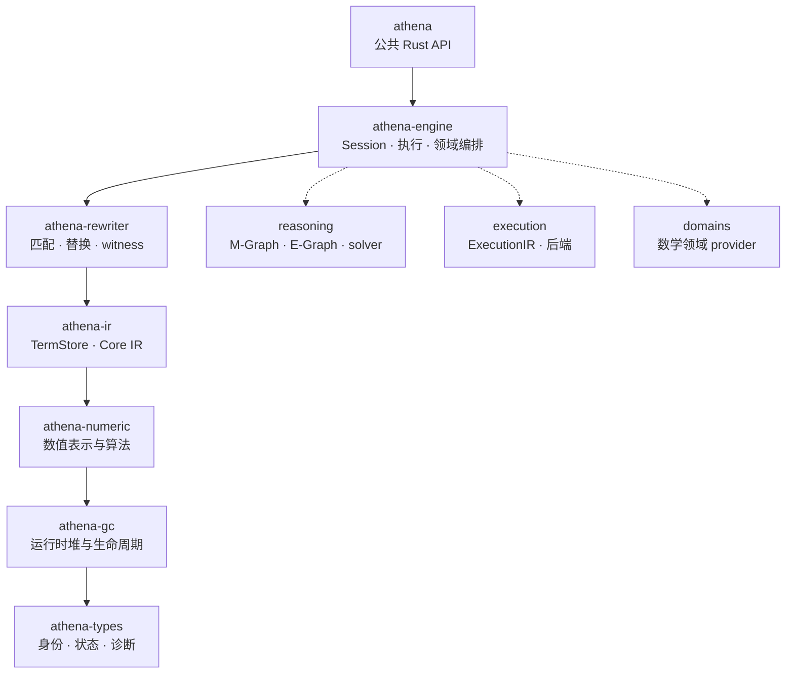

# Athena

**纯 Rust 计算机代数内核 · 精确数值 · 符号计算 · M-Graph 语义执行**

[](https://github.com/ai4waifu/athena.rs/actions/workflows/rust.yml)

[数学能力](#数学能力) · [快速开始](#快速开始) · [计算与推理](#计算与推理) · [数值内核](#数值内核) · [运行时与数据](#运行时与数据) · [架构导航](#架构导航) · [性能与验证](#性能与验证) · [参与开发](#参与开发)

Athena 将精确算术、符号变换和数学领域算法组织在同一个 Rust 内核中。从一个有理数、一条符号表达式，到多项式、矩阵和求解目标，计算共享类型化表示、会话与资源管理，并通过结构化结果表达计算结论及其适用范围。

**计算的价值，也包括知道结果为何成立。** Athena 以 M-Graph 为语义执行中心，围绕目标组织已有事实、候选变换、领域计算与证据验证。调用方可以追踪结果的条件、覆盖范围、诊断和来源，也能识别尚未完成的计算。


- **精确计算贯穿数值与符号层**：整数、有理数、模运算和多项式计算拥有明确的数值域与表示。
- **围绕目标组织计算**：M-Graph 连接关系事实，Reflector 识别缺口，领域 provider 提供计算和验证能力。
- **符号与执行各有表示**：`TermStore` 管理符号项，`ExecutionIR` 描述执行过程，重写器提供带适用条件的候选变换。
- **长计算具备资源边界**：会话、运行时堆、预算、取消和结果状态共同描述一次计算的生命周期。
- **从算术内核到 Rust 应用**：性能测量覆盖 limb kernel、数值对象、运行时与完整调用路径。默认采用纯 Rust 实现。

## 数学能力

Athena 的领域模块覆盖代数、数论、微积分、线性代数、求解与图论，共享数值层和执行基础设施。下表列出已有实现与正在推进的重点，每个领域均可直接进入源码或测试查看具体行为。

| 领域 | 已有实现与入口 | 正在推进 |
|---|---|---|
| [精确数值](projects/athena-numeric/readme.md) | 整数、有理数、精确除法、GCD、模算术、精度与数值序列化 | 更广的平台优化、数值块生命周期与高精度复合数值域 |
| [符号表示与重写](projects/athena-ir/readme.md) | 类型化符号项、构建与验证、规则匹配、替换、规范化基础 | 结构共享、指纹覆盖与条件重写的执行衔接 |
| [多项式与环](projects/athena-engine/src/domains/polynomial) | 系数域、环身份、多项式运算、因式分解与 Gröbner 算法路径 | 复杂求解中的证书重放、事实复用与可恢复计算 |
| [计算数论](projects/athena-engine/src/domains/number_theory) | 素数、整除、同余、因子分解与算术函数 | 素性和分解证据、资源截断、代数数论对象 |
| [域、群与伽罗瓦](projects/athena-engine/src/domains/algebra) | 代数 parent、有限域、扩张域、置换群与相关合同测试 | 表示转换、群与域对象的会话接入、跨域证书 |
| [线性代数](projects/athena-engine/src/domains/linear_algebra) | 矩阵对象、基础运算与线性求解路径 | 解空间、秩与零空间证书、稀疏和跨域视图 |
| [微积分](projects/athena-engine/src/domains/calculus) | 符号导数、基础积分、极限与级数、变换和 ODE 子集 | 条件、分支、余项、回代验证与完整性 |
| [方程求解](projects/athena-engine/src/domains/solve) | 求解问题、解集与覆盖状态，线性和单变量多项式接入 | 参数分支、高次根隔离与解集完备性 |
| [优化](projects/athena-engine/src/domains/optimization) | 变量、约束、目标、可行域和结果合同骨架 | 算法执行、可行性与最优性证书 |
| [图论](projects/athena-engine/src/domains/graph_theory) | 图对象上的领域请求、基础算法与证书路径 | 图身份、生命周期与更多算法的验证 |
| [绘图采样](projects/athena-engine/src/plot) | 一维采样域、采样点、策略与曲线数据 | 前端适配与可视化引擎对接 |

各领域的成熟度不同。目前，基础数值、IR、会话和多个领域已有实现与测试，复杂求解、统一证据链和部分领域仍在持续完善。上表中的入口同时保留部分结果、条件结果及资源限制等边界信息。

### 从算法到可复用的数学结果

以多项式计算为例，Athena 同时关注系数域、环身份、算法输出、结果完整性和验证证据。已有[多项式 M-Graph 测试](projects/athena-engine/tests/domains/polynomial/mgraph.rs)覆盖重复请求的结果复用、完整 Gröbner 结果的证据准入，以及预算截断时部分结果的保留。

同样的结果表达方式贯穿其它领域：积分携带成立条件，求解区分一个实例和解集覆盖范围，数论计算区分精确与概率性结论。这样，应用能够根据计算实际给出的保证继续处理结果。

## 快速开始

仓库使用 [nightly Rust](rust-toolchain.toml)。目前可通过本地路径依赖使用公共 crate，在调用项目的 `Cargo.toml` 中加入：

```toml
[dependencies]
athena = { path = "../athena.rs/projects/athena" }
```

路径相对于调用项目的 `Cargo.toml`，可按实际目录调整。`athena` 统一导出引擎、数值、IR 与领域 API。

### 精确计算一个分数

下面的完整示例构造 $\frac{1}{3} + \frac{1}{6}$，提交计算请求，再检查精确结果 $\frac{1}{2}$：

```rust
use athena::{
    api::AthenaRequest,
    ir::{Atom, SemanticOperator, TermNode},
    numeric::Number,
    types::ComputationStatus,
    AthenaEngine, Session,
};

fn main() -> athena::types::Result<()> {
    let engine = AthenaEngine::new();
    let mut session = Session::new();

    let sum = {
        let mut terms = session.builder();
        let a = terms.rational_i64(1, 3, Default::default())?;
        let b = terms.rational_i64(1, 6, Default::default())?;
        terms.application_semantic(SemanticOperator::Add, vec![a, b], Default::default())
    };

    let result_id = engine.execute_request(&mut session, AthenaRequest::Term(sum))?;
    let result = session.results.get(result_id).expect("stored result");
    assert_eq!(result.status, ComputationStatus::Exact);

    let term = result.symbolic_term.expect("symbolic result");
    let Some(TermNode::Atom(Atom::Number(value))) = session.arena.get(term) else {
        panic!("expected a numeric result");
    };
    assert_eq!(value, &Number::rational_i64(1, 2)?);

    println!("1/3 + 1/6 = 1/2 (Exact)");
    Ok(())
}
```

结果记录还提供运行时值、覆盖状态、来源与诊断。更多请求示例见[公共请求测试](projects/athena-engine/tests/api/request_boundary.rs)，包括领域目标、符号绑定和局部作用域。

在 Athena 仓库根目录生成并打开 API 文档：

```sh
cargo doc -p athena --no-deps --open
```

## 计算与推理

### 从请求到结果

`AthenaRequest` 描述符号计算、领域目标、会话命令或控制流程。`Session` 管理这些请求共享的符号项、运行时值、结果、作用域与数学对象。



`execute_request` 使用统一的 `ExecutionIR` 执行入口。`execute_domain_goal` 提供领域目标的语义入口，由 M-Graph、Reflector 与领域计划组织计算。两者的具体 API 见[引擎入口](projects/athena-engine/src/api/engine.rs)。

### M-Graph 与缺口驱动计算

M-Graph 将数学事实组织为带类型、作用域和证据的关系网络。它参与目标分解、事实复用、provider 选择、验证准入和增量闭包。

下图展示领域目标的语义循环。复杂求解中的证书覆盖、可恢复 frontier 与跨领域复用正沿这条路径逐步完善。



重写器与 E-Graph 探索等价候选。领域 provider 在适合的表示上进行计算，verifier 检查证据，AdmissionGate 将满足条件的关系纳入语义事实。条件事实携带自己的作用域，供后续查询和组合使用。

### 符号项、值、结果与关系

| 对象 | 表达的内容 | 使用方式 |
|---|---|---|
| `Term` | 数字、符号、算子应用与共享子项 | 由 `TermStore` 保存，通过 `TermId` 引用 |
| `Value` | 数值载荷和运行时领域对象 | 由数值上下文、堆或会话管理 |
| `Result` | 一次计算的值、状态、条件、覆盖与诊断 | 通过结果记录判断计算给出的保证 |
| `Relation` | 数学对象之间的事实、证据和依赖 | 在 M-Graph 中按类型与作用域查询、验证和传播 |

这四种对象让符号结构、实际数值、计算报告与数学事实拥有各自的生命周期。应用可以保留符号项继续变换，也可以读取计算报告，或在后续目标中复用已接纳关系。

### 结果保证

当前公共状态由 [`ComputationStatus`](projects/athena-types/src/status.rs) 表达，领域结果还可携带更细的证书与覆盖信息。

| 状态 | 调用方可以读到的含义 |
|---|---|
| `Exact` | 精确且无条件的计算结果 |
| `Verified` | 已经通过 verifier，具体保证由领域证书说明 |
| `Conditional` | 结果依赖显式假设或条件 |
| `Probable` | 概率性结论 |
| `Candidate` | 尚待验证或接纳的候选 |
| `Partial` | 已获得部分结果，任务仍有未完成部分 |
| `ResourceLimited` | 计算受到预算或资源限制 |
| `Unknown` | 当前能力或信息下尚未判定 |
| `Invalid` | 输入或状态无效 |

诊断包含稳定 code、结构化参数、详情和 source span，供宿主应用定位问题和呈现信息。

## 数值内核

### 数值表示与精度

`athena-numeric` 将数值表示、算法选择、底层运算、执行预算和证书分层组织。整数与有理数提供精确算术，实数、复数、区间及代数相关类型在各自的域中表达精度与运算含义。



- **整数与有理数**：规范化 magnitude、符号和分母保证数值表示一致，支持精确整除和交叉约分。
- **大整数算法**：多 limb 算术、Karatsuba 与 Toom 乘法、分块除法、GCD 和 Montgomery 模运算按职责拆分。
- **精度与舍入**：数值转换显式表达精度与 promotion，`Decimal` 的舍入在数值表示层处理。
- **借用与复用**：`MagnitudeView` 提供借用视图，owned 路径与目标缓冲区复用分别计量分配成本。
- **证书与序列化**：数值结果、证据和 canonical wire 支持验证、传输与回归检查。

复数、区间、代数数及部分高精度能力仍在完善，其具体运算范围可从[数值实现](projects/athena-numeric/src)和[合同测试](projects/athena-numeric/tests)查阅。

### Core IR、ExecutionIR 与重写

**Core IR** 由 `TermStore` 管理符号项，通过 ID 引用子项。构造、验证、哈希与序列化共同维护符号结构，支持跨步骤引用和复用。

**ExecutionIR** 描述编译后的模块、调用、绑定与领域分派，由执行后端处理。符号结构与执行计划分别承担表示和运行职责。

**重写器** 提供 pattern、binding、match、substitution、规范化与 witness。规则的前置条件和适用作用域跟随候选进入后续处理。

进一步阅读：[IR](projects/athena-ir/readme.md) · [重写器](projects/athena-rewriter/readme.md) · [算术算法](projects/athena-numeric/src/algorithm/readme.md)。

## 运行时与数据

### GC 与对象生命周期

长时间符号计算会不断产生数值块、表达式和临时结果。`athena-gc` 为这些对象提供运行时堆、root、tracing、pin、scratch、预算与统计，`Session` 负责上层对象和结果的生命周期编排。



| 生命周期概念 | 含义 |
|---|---|
| 可达性 | 对象是否仍由 root 引用链到达 |
| 驻留性 | 数据当前位于哪一层存储 |
| Pin | 在操作期间保持对象所需的驻留或生命周期约束 |
| Scratch | 通过 frame 与 mark/rewind 管理临时空间 |
| 发布 | 将临时计算结果交给调用方或较长生命周期的对象 |
| 预算 | 管理分配、峰值、取消与资源耗尽 |

`GcMode::Auto`、`Deferred` 和 `Disabled` 为不同执行场景提供作用域策略。完整跨层 tracing 与回收路径仍在推进，现有行为见 [GC 合同测试](projects/athena-gc/tests/contract)。

### 图、数组、表格与加速

| 组件 | 数据与能力 | 与计算内核的关系 |
|---|---|---|
| [`athena-graph`](projects/athena-graph/readme.md) | `GraphId`、revision、节点与边引用、CSR/CSC、视图和图原语 | 为图数据与图论 provider 提供基础设施 |
| [`athena-ndarray`](projects/athena-ndarray/readme.md) | 数组身份、shape、stride、view、broadcast 和分块存储 | 为多维数据与跨域视图提供表示 |
| [`athena-table`](projects/athena-table/readme.md) | schema、列式数据与惰性查询合同 | 组织结构化数据和查询计划 |
| [`athena-jit`](projects/athena-jit/readme.md) | 可选 native 编译、guard 与退出合同 | 默认关闭，真实加速后端与语义闭环仍在推进 |
| [绘图采样](projects/athena-engine/src/plot) | 采样域、采样点与曲线数据 | 将数学计算结果交给前端与绘图引擎 |

逻辑对象身份与物理布局分别管理：图的 revision 描述图状态，数组的 shape 描述布局，chunk 的驻留描述存储状态。这样，领域算法可以在所需视图上执行，并保留对象来源和资源约束。

## 架构导航

七个基础 crate 构成从共享类型到 Rust 公共入口的分层。下图按“上层使用下层”组织，数学领域与推理模块位于 `athena-engine` 内部。



| 阅读方向 | 入口 | 继续探索 |
|---|---|---|
| 使用 Rust API | [`athena`](projects/athena/readme.md) | 请求、会话、结果与 re-export |
| 共享类型与诊断 | [`athena-types`](projects/athena-types/readme.md) | ID、status、diagnostic、scope |
| 对象生命周期 | [`athena-gc`](projects/athena-gc/readme.md) | root、trace、scratch、segment、budget |
| 数值与算术 | [`athena-numeric`](projects/athena-numeric/readme.md) | representation、algorithm、kernel、dispatch |
| 符号结构 | [`athena-ir`](projects/athena-ir/readme.md) | builder、TermNode、TermStore、canonical |
| 规则与变换 | [`athena-rewriter`](projects/athena-rewriter/readme.md) | pattern、binding、substitution、witness |
| 执行与推理 | [`athena-engine`](projects/athena-engine/readme.md) | api、runtime、execution、reasoning、domains |
| 共享测试工具 | [`athena-testing`](projects/athena-testing) | builders、assertions、lifecycle、mgraph |
| 性能与资源 | [`athena-benchmark`](projects/athena-benchmark/readme.md) | bigint、allocation、path、report |

前端或宿主应用负责解析源语言、渲染结果和平台适配，将输入转换为 Athena 的类型与请求后，通过 `athena` 调用内核。默认实现采用纯 Rust，BLAS、MKL 等外部加速保持可选边界。

## 性能与验证

### 按计算路径测量性能

Athena 的性能工作同时关注算术速度与整个计算过程的成本。借用、复制、promotion、GC、证据检查和结果发布都可能影响最终耗时，基准按层记录这些开销。

| 测量层 | 关注内容 | 典型用途 |
|---|---|---|
| Limb kernel | 加减乘除、GCD、模运算 | 比较算法和平台指令路径 |
| Numeric | 数值对象、上下文、promotion、缓冲区复用 | 定位表示和分配成本 |
| IR | 构造、哈希、验证与重写 | 检查结构处理的开销 |
| Execution | 编译、reference backend 与分派 | 观察执行管线成本 |
| Runtime | root、scratch、GC 与发布 | 分析对象生命周期 |
| End-to-end | 公共 API 到计算结果 | 衡量应用实际调用路径 |

```sh
cargo run -p athena-benchmark --release --bin athena-bench -- --groups bigint --format text
cargo bench -p athena-benchmark --bench allocation_modes
cargo bench -p athena-benchmark --bench path_segments
cargo bench -p athena-benchmark --features compare-bigint --bench compare_bigint
```

[基准文档](projects/athena-benchmark/readme.md)提供参考读数、输入规模与报告说明。比较时应保持硬件、输入、构建配置和测量层一致。外部大整数库作为可选对照依赖，用于观察正确性与性能差异。

### 跨平台 CI

[CI 工作流](.github/workflows/rust.yml)在 Ubuntu、macOS 与 Windows 上检查和测试工作区，使用 nightly Rust 与 Node.js 22。覆盖率单独生成 summary、LCOV 和 HTML 报告，供定位测试缺口。

| 检查 | 命令 |
|---|---|
| 迁移过期检查 | `node scripts/migration/check-expiry.mjs` |
| 公共边界检查 | `node scripts/check-neutral-surface.mjs` |
| 编译检查 | `cargo check --workspace --all-targets` |
| 工作区测试 | `cargo test --workspace --features athena-numeric/ephemeral` |
| 覆盖率 | `cargo llvm-cov --workspace --features athena-numeric/ephemeral --summary-only` |

<details>
<summary>测试覆盖：数值、符号、推理与生命周期</summary>

| 范围 | 重点验证 |
|---|---|
| 共享类型 | ID、状态映射、诊断字段与序列化 |
| 数值表示 | 规范 magnitude、符号、借用视图、owned buffer 与回收 |
| 数值算法 | 随机差分、边界 limb、除零、整除、promotion 与取消 |
| IR | 构造、哈希、验证、round-trip 与非法节点拒绝 |
| 重写 | 匹配、替换、终止性、witness 与冲突 |
| M-Graph | scope、关系索引、候选、准入、证据重放与冲突 |
| Solver | 缺口、Reflector、Frontier、覆盖状态与预算 |
| 数学领域 | 精确、条件、部分、未知与资源截断结果 |
| GC | root、trace、pin、scratch、mode、budget 与回收 |
| 图与数组 | revision、view、shape、stride、chunk 与生命周期 |
| JIT 合同 | guard、退出路径、目标平台与禁用 feature |

共享工具位于 [`athena-testing`](projects/athena-testing)，行为测试保留在各 crate 的 `tests/` 中。

</details>

## 参与开发

在仓库根目录运行常用检查：

```sh
cargo fmt --all -- --check
cargo check --workspace --all-targets
cargo test --workspace --features athena-numeric/ephemeral
cargo clippy --workspace --all-targets -- -D warnings
```

迭代单个模块时，可以先运行对应 crate 或测试分组：

```sh
cargo test -p athena-engine --test main api::request_boundary
cargo test -p athena-numeric --test main promotion
cargo test -p athena-ir
cargo doc -p athena --no-deps
```

数值与对象语义改动应覆盖正常输入、边界输入、资源限制和结构化错误。算法优化应同时记录对应层的基准，便于区分运算改进与生命周期成本。

<details>
<summary>修改影响与提交检查</summary>

| 修改位置 | 联动检查 |
|---|---|
| `athena-types` | ID、状态、诊断、wire 与序列化消费者 |
| `athena-gc` | 数值块、IR 对象、root、pin、scratch 与 Session |
| `athena-numeric` | kernel、planner、dispatch、certificate 与 benchmark |
| `athena-ir` | builder、verify、hash、rewriter 与执行编译器 |
| `athena-rewriter` | pattern、rule、witness、候选准入与诊断 |
| `athena-engine` | API、runtime、execution、reasoning 与领域测试 |
| 领域 provider | request、plan、artifact、result、证书与资源状态 |
| `athena` | re-export、公共路径与文档示例 |
| 图、数组与表格 | identity、revision、storage、budget 与跨域视图 |
| JIT | reference baseline、guard、退出路径与平台 feature |

提交前检查：

- [ ] 对象身份、生命周期、作用域与结果保证保持一致。
- [ ] 新符号节点覆盖构造、验证、哈希与错误路径。
- [ ] 重写规则明确前置条件、适用范围与 witness。
- [ ] 资源耗尽和取消保留诊断与可解释的结果状态。
- [ ] 数值优化具有对应层的正确性检查与性能基线。
- [ ] 默认构建保持纯 Rust，平台相关实现具有明确边界。
- [ ] 已执行适用的格式、编译、测试和 lint 检查。

</details>

<details>
<summary>问题定位索引</summary>

| 现象 | 优先检查 |
|---|---|
| 编译或 feature 失败 | nightly 工具链、workspace、目标平台与 feature |
| 数值精度异常 | 数值域、promotion、规范 limb、舍入与精确除法 |
| 符号身份或哈希异常 | TermStore、子项引用、canonical hash 与序列化 |
| 重写结果异常 | 匹配、绑定、前置条件、witness 与 admission |
| 返回 Candidate 或 Partial | provider 能力、Frontier、覆盖状态与预算 |
| 返回 Unknown 或 ResourceLimited | 假设范围、未满足目标、取消与资源状态 |
| M-Graph 事实冲突 | scope、关系类型、证据重放与依赖 |
| 内存增长或回收异常 | root、Trace、pin、scratch、publish 与 heap 预算 |
| 性能回退 | kernel、numeric、IR、分配、promotion、验证与发布分段读数 |
| JIT 合同行为异常 | reference 结果、guard、退出路径与目标平台 |

</details>

## 许可证

Apache-2.0，见 [`License.md`](License.md)。
