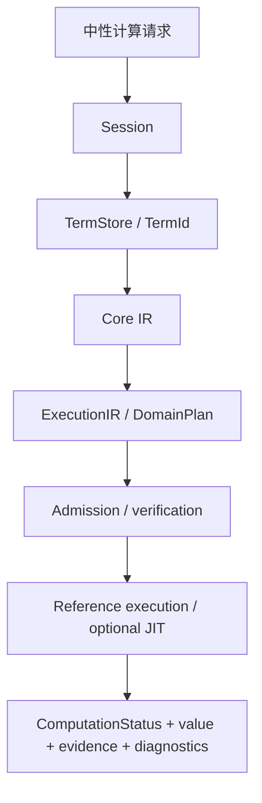
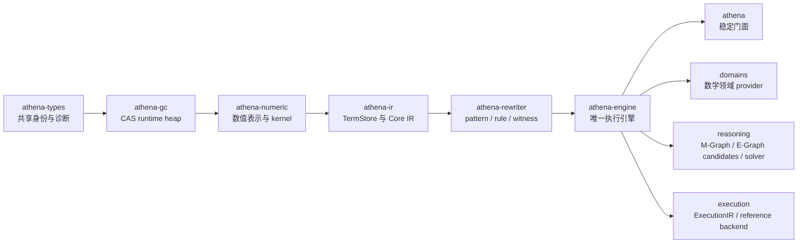
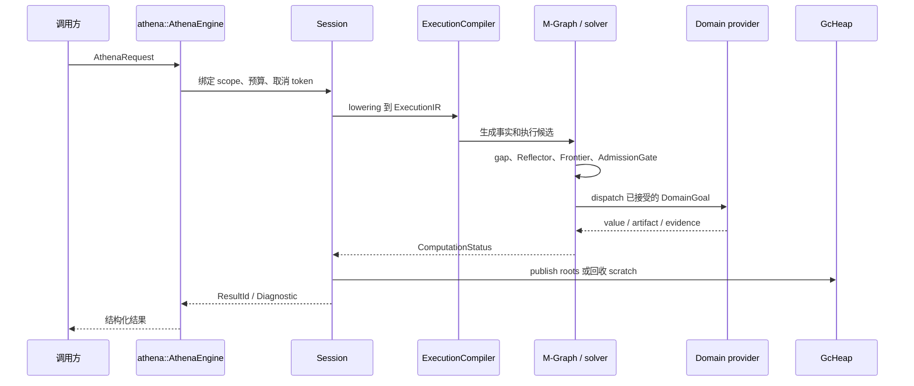
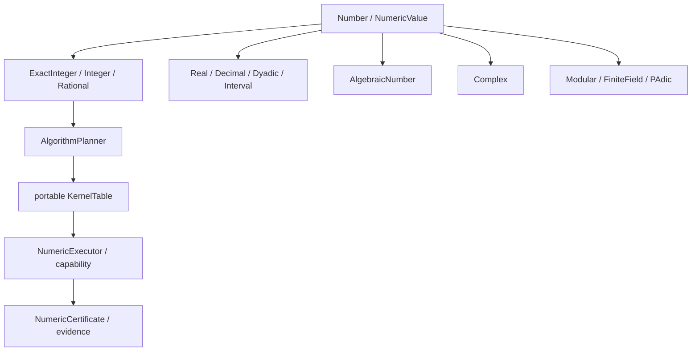
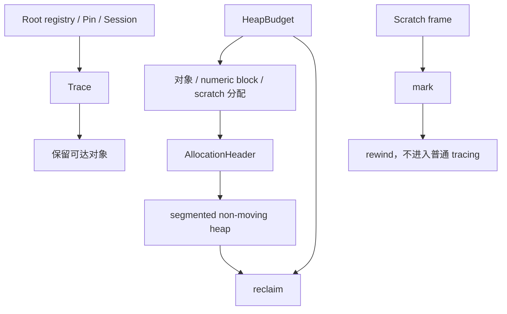

# Athena

[](https://github.com/ai4waifu/athena.rs/actions/workflows/rust.yml)

## 这是什么

Athena 是纯 Rust 计算机代数内核。它不是一个把字符串直接丢进黑盒求值器的库，而是一套从稳定术语身份、精确数值、Core IR、重写候选、关系事实到结构化结果的执行基础设施。



内核的关键原则是：**语义先于算法，身份先于缓存，证据先于完成态**。`Term`、`Value`、`Result`、`Relation` 不是同一个对象的不同叫法。`Exact`、`Verified`、`Conditional`、`Probable`、`Candidate`、`Partial`、`ResourceLimited`、`Unknown` 和 `Invalid` 代表不同的计算承诺。

## 阅读地图

| 目的 | 先读什么 | 继续阅读 |
|---|---|---|
| 只想调用内核 | `projects/athena/readme.md` | `athena-engine` 的 API 和 request |
| 理解公共类型 | `projects/athena-types/readme.md` | `ids`、`status`、`diagnostic`、`scope` |
| 理解符号表示 | `projects/athena-ir/readme.md` | `TermStore`、`TermNode`、builder、verify |
| 理解大整数 | `projects/athena-numeric/readme.md` | `src/algorithm/readme.md`、kernel、dispatch |
| 理解执行主线 | `projects/athena-engine/readme.md` | `api`、`runtime`、`execution`、`reasoning` |
| 理解垃圾回收 | `projects/athena-gc/readme.md` | budget、root、trace、scratch、segment |
| 理解领域能力 | `athena-engine/src/domains` | algebra、calculus、field、galois、group、linear_algebra、number_theory、optimization、polynomial、solve |
| 理解测试基础设施 | `projects/athena-testing` | assertions、contract、domains、execution、lifecycle、mgraph、rewrite |
| 理解性能读数 | `projects/athena-benchmark` | allocation、bigint、path、report、validate |

## 架构分层



基础依赖方向固定为：

```text
athena-types → athena-gc → athena-numeric → athena-ir → athena-rewriter → athena-engine → athena
```

领域模块位于 `athena-engine` 内部。数学能力不能通过新增一个平行 engine 或 solver crate 来逃避已有边界。`athena-gc` 是运行时 GC heap，不是数值小工具。`athena-graph` 是普通离散图基础设施，不是 M-Graph 语义层。

## 四种身份

| 身份 | 所在位置 | 生命周期 | 可以做什么 | 不能做什么 |
|---|---|---|---|---|
| `Term` | `athena-ir` / `TermStore` | store 或 session | 表达符号结构、结构共享、哈希 | 直接代表已执行结果 |
| `Value` | runtime / numeric | context、heap 或发布结果 | 表达数值和运行时对象 | 代替关系证据 |
| `Result` | engine runtime | 一次请求或发布阶段 | 表达结果状态和诊断 | 只用 `bool complete` |
| `Relation` | reasoning / M-Graph | scope、证据和版本 | 表达事实、依赖和可传播关系 | 把候选直接当 exact |

## 从请求到结果



公共 API 入口是 `AthenaEngine`、`EvalOptions`、`SimplifyOptions`、`Session` 和 `AthenaRequest`。`athena-engine::execute_ir_request` 是唯一的 `ExecutionIR` 执行路径。测试辅助函数不能成为第二套产品执行模型。

## 请求、计划和执行的边界

| 阶段 | 代表对象 | 责任 | 失败时的状态 |
|---|---|---|---|
| request | `AthenaRequest`、`DomainRequest` | 描述要做什么 | `Invalid` 或诊断 |
| lowering | compiler、`ExecutionIR` | 将中性请求编译为执行表示 | `Invalid` |
| planning | `DomainPlan`、`PlanStep` | 选择领域 capability 和步骤 | `Candidate`、`Unknown` |
| reasoning | M-Graph、Reflector、Frontier | 发现缺口、产生和筛选候选 | `Candidate`、`Partial` |
| admission | verifier / gate | 接受可传播事实 | `Verified`、拒绝诊断 |
| execution | reference backend、provider | 执行已接受计划 | `Exact`、`Conditional`、`ResourceLimited` |
| publication | runtime result store | 发布值、证据和诊断 | 结构化 `Result` |

不能把 `DomainPlan` 当作结果，不能把 `Candidate` 当作 `Verified`，不能把 `ResourceLimited` 当作 `Unknown`，也不能把一个 provider 的局部成功当作完整求解。

## 数值塔

`athena-numeric` 分为表示、算法、kernel、dispatch、policy、certificate 和 wire 等层。公共数值语义不依赖第三方 bigint 类型。



数值层必须维护：

- `Natural` 的非负规范 magnitude。
- `Integer` 的符号与 magnitude 分离，禁止负零。
- `Rational` 的正分母和交叉约分。
- 多 limb 加减乘除、GCD、Montgomery 和幂运算的精确后置条件。
- `MagnitudeView` 等借用路径与 owning 路径的成本区别。
- promotion、precision、rounding、interval decoration 和 capability 状态。
- 领域数值证书与普通数值结果的区别。

不要把 `num-*` 类型作为 Athena 的公共数值语义。第三方库只能在明确隔离的对照或 foreign oracle 路径中出现。

## Core IR、ExecutionIR 与重写

Core IR 表达可共享的符号结构，`TermStore` 通过稳定 ID 引用子项。Core IR 的验证、canonical hash、序列化和结构共享共同决定术语是否可进入执行链路。

`ExecutionIR` 是执行层表示。它负责把已确定的中性请求编译为 backend 能执行的模块、调用、绑定和 domain dispatch。不能让某个旧的表达式树、测试 helper 或领域 provider 重新建立第二套 execution IR。

`athena-rewriter` 负责 pattern、binding、rule、match、substitution、规范化和 witness。重写产生的是候选变换，是否可传播要经过执行和验证合同。规则必须说明前置条件、适用 scope、终止性和失败诊断。

## M-Graph、E-Graph 候选和 solver


M-Graph 是事实和关系的执行中心。E-Graph 或 rewriter candidate 用于探索等价候选，不能直接成为可信事实。solver 调度 `SolverRequest`、registry、frontier 和 reflector，`solve/` 中的数学对象不能和调度协议混淆。复杂求解的完整性、覆盖度和资源截断必须写入结果状态。

## 数学领域地图

| 模块 | 当前职责 | 主要合同 |
|---|---|---|
| `algebra` | 代数对象和基础运算 | 类型、结构和证书边界 |
| `calculus` | 微分、积分、级数等 | 条件、分支、未完成结果 |
| `field` | 域和有限域相关操作 | modulus、表示、精确性 |
| `galois` | Galois 相关结构 | presentation 和验证 |
| `group` | 群与群结构 | 生成元、关系和证书 |
| `linear_algebra` | 矩阵、线性映射、解空间 | rank、nullspace、视图和预算 |
| `number_theory` | 数论例程 | 精确整除、因子、素性状态 |
| `optimization` | 优化问题合同和规划骨架 | 可行性、目标、bound、精确/近似边界 |
| `polynomial` | 环、多项式和复杂代数求解 | 表示、frontier、证书、资源限制 |
| `solve` | 求解问题与解集 | `CoverageStatus`、条件和完备性 |
| `graph_theory` | 图论领域语义 | 算法证书和普通图原语之上的数学包装 |
| `views` | 跨领域 typed view | fingerprint、revision、lease 和 capability |
| `plot` | 1D 采样输入 | `SampleDomain`、`SamplePoint`、`SamplingPolicy` |

领域模块必须通过统一的 request、plan、artifact、result 和 diagnostic 合同接入。禁止每个领域私自定义一个 `complete: bool`、一个裸错误字符串或一套旁路执行器。

## Runtime GC 与对象生命周期



`athena-gc` 负责 `GcHeap`、`ArenaHeap`、allocation header、segment、root registry、`Trace`、pin、scratch、统计和 `GcMode` guard。`GcMode::{Auto, Deferred, Disabled}` 是作用域策略，不是全局数学开关。

必须区分：

| 概念 | 含义 |
|---|---|
| reachability | root 能否到达对象 |
| residency | 对象当前是否驻留某个存储区域 |
| pin | 对象在一段操作中不能移动或回收 |
| scratch | 可通过 mark/rewind 回收的临时空间 |
| publish | 将临时对象变成结果或长期对象 |
| budget | 分配、峰值和回收策略的资源上限 |

不要创建 `athena-arena`。不要让 `athena-gc` 依赖数值、IR 或 engine 来理解数学语义。

## 图、数组、表格与 JIT 扩展

| 组件 | 一等身份 | 允许做什么 | 不允许做什么 |
|---|---|---|---|
| `athena-graph` | `GraphId`、`GraphRevision`、`NodeRef`、`EdgeRef` | CSR/CSC、view、BFS、SCC、topological sort | 发布 M-Graph claim |
| `athena-ndarray` | `ArrayId`、shape、layout、chunk | stride、view、broadcast、out-of-core | 定义设备 tensor runtime |
| `athena-table` | schema、column、logical plan | 列式数据和惰性查询 | 冒充 ML estimator |
| `athena-jit` | compiled path、guard、deopt | 可选 native 加速 | 改变 exact 或诊断语义 |
| `athena-plot` 能力 | sample domain、point、curve | 采样和数据合同 | 渲染器或界面 |

普通图的连通性不是 M-Graph 的事实闭包。数组的 shape 不是 `ArrayId`。chunk 驻留不是逻辑可达性。JIT guard 失败必须回退到声明过的 eager 或 partial 路径。

## CI、合并门禁与预算

CI 当前使用 nightly Rust，在 Ubuntu、macOS、Windows 三平台构建和测试，并使用 Node 22 执行两个仓库检查脚本。覆盖率 job 是报告任务，`continue-on-error: true`，不按百分比阻断合并。

| 检查 | CI 命令 | 环境 | 失败含义 |
|---|---|---|---|
| 迁移过期检查 | `node scripts/migration/check-expiry.mjs` | 三平台 | 迁移合同仍有过期项 |
| 中性表面检查 | `node scripts/check-neutral-surface.mjs` | 三平台 | 公共边界出现禁用表面 |
| 工作区检查 | `cargo check --workspace --all-targets` | 三平台 | 编译或目标检查失败 |
| 工作区测试 | `cargo test --workspace --features athena-numeric/ephemeral` | 三平台 | 行为合同失败 |
| 覆盖率报告 | `cargo llvm-cov --workspace --features athena-numeric/ephemeral` | Ubuntu | 生成 summary、LCOV 和 HTML 报告 |

性能预算不是一个脱离输入和平台的固定数字。每次新增或修改 benchmark 都必须写明：

| 层 | 需要单独测量 | 不能混入 |
|---|---|---|
| limb kernel | 加减乘除、GCD、模运算 | heap、clone、Session |
| numeric | 数值域、promotion、复用 context | facade、诊断渲染 |
| IR | 构造、hash、verify、重写 | 领域算法和外部输入 |
| execution | compile、reference backend、dispatch | provider 外部工作流 |
| runtime | root、scratch、GC、publish | 纯算术指令成本 |
| end-to-end | 公共 API 到结果 | 不能代替分层基线 |

性能回归首先要定位成本属于算法、分配、owning conversion、promotion、索引、证据、诊断还是结果发布。不能只看总耗时修改乘法算法，也不能把单机基准数字写成跨平台保证。

## 测试矩阵

| 变更 | 需要验证 |
|---|---|
| 共享类型 | ID 唯一性、状态映射、诊断字段、序列化 |
| 数值表示 | 规范 magnitude、负零、借用 view、owned buffer、回收 |
| 数值算法 | 随机差分、边界 limb、除零、整除、promotion、取消 |
| IR | 构造、结构共享、hash、verify、round-trip、拒绝非法节点 |
| 重写 | match、substitution、循环、终止性、witness、冲突 |
| M-Graph | scope、relation index、candidate、admission、replay、冲突 |
| solver | gap、reflector、frontier、fallback、CoverageStatus、预算 |
| 领域模块 | 正常结果、条件结果、部分结果、未知、资源截断 |
| GC | root、trace、pin、scratch、mode、budget、reclaim |
| 普通图 | revision、view、CSR/CSC、空图、路径和大图 |
| 数组和表格 | shape、stride、chunk、schema、惰性计划、预算 |
| JIT | guard 成功、guard 失败、deopt、禁用 feature、语义一致 |

共享测试工具集中在 `athena-testing`。基准集中在 `athena-benchmark`，不得把 benchmark 的对照库依赖传入 Athena 核心 crate。

## 修改影响矩阵

| 修改位置 | 必须同步检查 |
|---|---|
| `athena-types` | 所有 crate 的 ID、状态、诊断、wire 和序列化 |
| `athena-gc` | numeric block、IR object、root、pin、scratch、Session |
| `athena-numeric` | kernel、planner、dispatch、certificate、benchmark |
| `athena-ir` | builder、verify、hash、rewriter、ExecutionCompiler |
| `athena-rewriter` | pattern、rule、witness、M-Graph candidate、诊断 |
| `athena-engine` | API、runtime、execution、reasoning、domains、tests |
| domain provider | request、plan、artifact、result、证书、资源状态 |
| `athena` | re-export、公共路径、文档示例和兼容性 |
| graph / ndarray / table | identity、revision、storage、budget、跨域 view |
| JIT | reference baseline、guard、deopt、跨平台 feature |

## 维护者提交前检查

```text
[ ] 改动属于已有 crate 的明确职责
[ ] 没有新增平行 engine、solver、arena 或第二套 IR
[ ] 公共对象的身份、生命周期和状态没有被隐式改变
[ ] exact、verified、conditional、partial、unknown 等状态仍可区分
[ ] 资源耗尽和取消路径有结构化结果
[ ] 数值改动有 kernel / numeric / end-to-end 分层基线
[ ] 新节点有构造、验证、哈希和失败测试
[ ] 新规则有前置条件、终止性和 witness 测试
[ ] 跨平台 default feature 不依赖 MKL、BLAS 或系统 GPU
[ ] fmt、check、test、clippy 和必要 benchmark 已运行
```

## 故障排查

```text
编译或 feature 失败
  → nightly、workspace、目标平台、默认 feature、依赖方向

数值结果不精确
  → NumericValue、promotion、规范 limb、精确除法、隐式转换

术语身份或哈希变化
  → TermStore、结构共享、canonical hash、序列化和 ID 生命周期

重写后结果异常
  → pattern、binding、rule 前置条件、循环、witness、admission

结果为 Candidate 或 Partial
  → Frontier、Reflector、provider 能力、CoverageStatus 和资源预算

结果为 Unknown 或 ResourceLimited
  → scope、缺口、取消 token、执行预算、证据和 fallback

M-Graph 事实不一致
  → relation index、scope、证据重放、事实状态和冲突处理

回收错误或内存增长
  → root、Trace、pin、scratch、publish、segment、HeapBudget

性能回退
  → 先拆 kernel、numeric、IR、GC、clone、promotion、索引、发布

JIT 结果不一致
  → 禁用 JIT，比较 reference backend、guard 和 deopt 路径
```

## 本地开发

```sh
cargo fmt --all -- --check
cargo check --workspace --all-targets
cargo test --workspace --features athena-numeric/ephemeral
cargo clippy --workspace --all-targets -- -D warnings
cargo doc -p athena --no-deps
cargo run -p athena-benchmark --release -- --groups numeric,ir --format json
```

覆盖率报告：

```sh
cargo llvm-cov --workspace --features athena-numeric/ephemeral --summary-only
cargo llvm-cov --workspace --features athena-numeric/ephemeral --lcov --output-path lcov.info
```

## 稳定性和当前状态

仓库使用 nightly toolchain。crate 的存在、模块导出或测试 helper 不自动等于稳定公共 API。公共稳定性由导出路径、行为合同、诊断、资源状态、跨平台构建和回归测试共同决定。

当前基础路径包括数值表示、runtime heap、Core IR、重写器、执行 API、领域模块、图和数组基础设施。复杂领域能力仍可能处于骨架、部分实现或逐步收口阶段，判断一项能力是否可用必须查看对应源码、测试、错误路径和 benchmark，而不是只看模块名称。

## 许可证

Apache-2.0，见 [`License.md`](License.md)。

Athena 是一个纯 Rust 计算机代数内核。它把数值、符号表达式和计算请求转换为可验证的 Core IR，在统一的求值、重写和会话模型中执行，并返回结构化结果或诊断。

Athena 适合需要精确数值、符号变换、代数化简、微积分和领域算法的 Rust 程序。它不解析源语言文本，不包含命令行界面，不持有设备或平台对象。调用方负责把输入构造成
Athena 的类型和 IR，再通过公共门面提交计算。

## 能力边界

Athena 内核负责：

- 精确整数、有理数及其它数值域的表示、精度和 promotion。
- Runtime heap 管理的 Core IR 与数值 block、稳定 ID、结构共享、验证和确定性哈希。
- 求值、符号绑定、作用域、会话状态和资源限制。
- 规范化、规则重写、化简以及可组合的 rewrite pipeline。
- 微分、积分、级数、变换、数论和其它领域算法。
- 语言无关的结构化诊断和可取消的计算流程。

内核不负责源文本解析、语法树、渲染、用户界面、平台绑定或应用工作流。任何外部输入都必须先转换为 `athena-types` 和 `athena-ir`
能理解的值或节点。

## 计算路径

```text
构造 Number / Core IR
        ↓
athena（稳定公共门面）
        ↓
athena-engine（求值、重写、Session、领域算法）
        ↓
RuntimeValue / Diagnostic
```

`athena` 负责公开 API 和兼容边界，`athena-engine` 负责执行实现。依赖方向只能是 `athena → athena-engine`，不得反向依赖，也不得在
facade 中复制另一套求值或会话语义。

## Crate 分层

| Crate                                                     | 作用                                                             |
|-----------------------------------------------------------|------------------------------------------------------------------|
| [`athena-types`](projects/athena-types/readme.md)         | 共享 ID、数值元数据、诊断、span 和版本合同                       |
| [`athena-gc`](projects/athena-gc/readme.md)               | CAS runtime GC heap：segmented arena、tracing、scratch、`GcMode` |
| [`athena-numeric`](projects/athena-numeric/readme.md)     | 数值塔、精度、promotion 和数值证书                               |
| [`athena-ir`](projects/athena-ir/readme.md)               | Core IR、构建器、验证和哈希（对象存储终局归属 runtime heap）     |
| [`athena-rewriter`](projects/athena-rewriter/readme.md)   | 规范化、规则匹配、重写结果和重写诊断                             |
| [`athena-engine`](projects/athena-engine/readme.md)       | 唯一执行引擎，包含 Session、M-Graph、solver 和领域编排           |
| [`athena`](projects/athena/readme.md)                     | 薄公共门面和稳定 re-export                                       |
| [`athena-ndarray`](projects/athena-ndarray/readme.md)     | CAS N 维数组与 out-of-core storage                               |
| [`athena-graph`](projects/athena-graph/readme.md)         | 普通离散图与大图算法基座（非 M-Graph）                           |
| [`athena-table`](projects/athena-table/readme.md)         | 列式表、schema 与惰性查询合同（非 ML）                           |
| [`athena-benchmark`](projects/athena-benchmark/readme.md) | 固定输入集上的性能和资源基准                                     |

依赖方向：`types → gc → numeric → ir → rewriter → engine → athena`。数学主题应作为已有 crate
中职责清晰的模块演进。除非依赖关系、版本生命周期和测试边界确实独立，否则不要新增微型 crate。`athena-gc` 是运行时基础层，不是领域微
crate；禁止再拆 `athena-arena`。M-Graph 和 solver 继续归属于 `athena-engine`，不另建同名 crate。

## 当前状态

基础数值合同、Core IR
arena、重写器、公共门面以及多个求值和领域模块已经存在。部分领域能力仍处于逐步扩展阶段，代码中出现的类型或模块不代表已经具备稳定的生产兼容承诺。判断一项能力是否可用，应以对应测试、边界行为和错误路径为准。

## 开发与验证

需要 Rust 工具链和 Cargo。常用验证命令：

```sh
cargo test --workspace
cargo test -p athena-numeric --test main promotion
cargo fmt --all -- --check
cargo clippy --workspace --all-targets -- -D warnings
cargo llvm-cov --workspace --summary-only
cargo run -p athena-benchmark --release -- --groups numeric,ir --format json
```

迭代单个 crate：

```sh
cargo test -p athena-engine --test main
cargo test -p athena-numeric --test main
cargo test -p athena-ir
cargo doc -p athena --no-deps
```

行覆盖率用 `cargo llvm-cov` 汇报（CI 上传 artifact 与 job summary），不设百分比失败门槛。测试布局见 Living「测试与验收」：每
crate `tests/main.rs` + 域 `mod.rs`。

修改数值、IR、求值、重写或对象语义时，应同时覆盖正常结果、边界输入、资源限制和结构化错误路径。默认保持纯 Rust，并确保 `wasm32`
构建不依赖系统 GPU、MKL 或 BLAS。

## 诊断与数值原则

诊断使用稳定 code、结构化参数、详情和 source span，不在内核中写面向用户界面的自然语言文案。数值转换必须显式表达精度和
promotion，禁止通过隐式机器浮点转换丢失精确性。

## 许可证

Apache-2.0，见 [`License.md`](License.md)。
